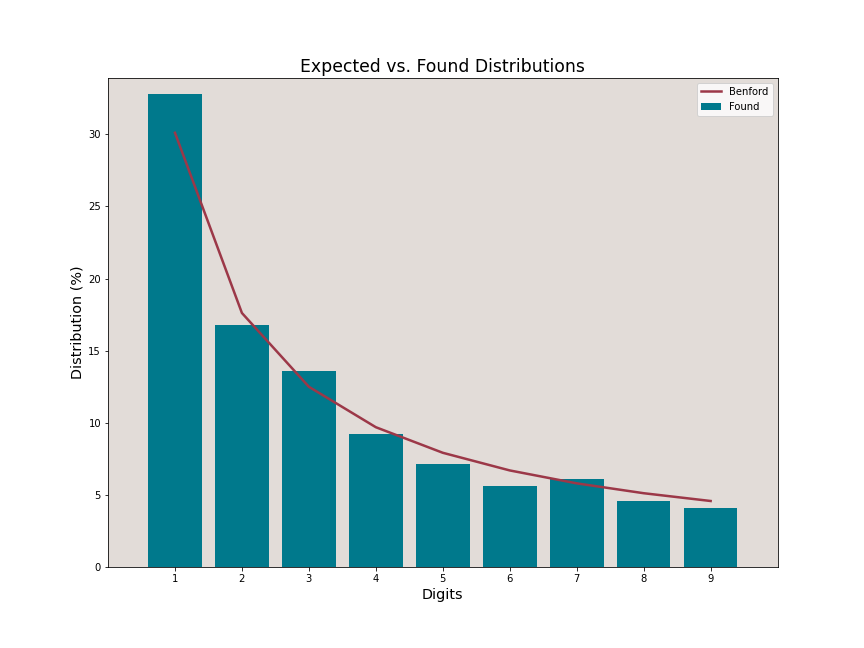
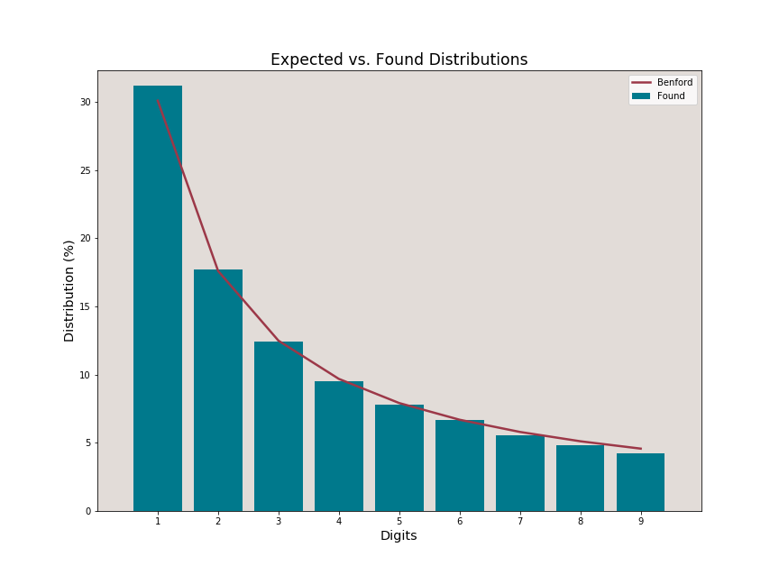
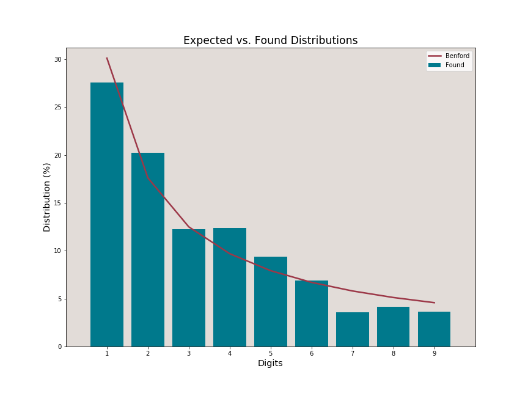

# Benford's Law and COVID19 reporting

For many countries attempting to control the fast-rising number of coronavirus cases and deaths, the race is on to “flatten the curve,” since the spread of COVID19 has taken on pandemic proportions.
In the absence of significant control interventions, the curve could be steep, with the number of COVID-19 cases growing exponentially. This level of proliferation has already been observed all across the globe, especially in countries like Italy, USA and India.

When the numbers are taken from an exponential distribution, it has been demonstrated that they automatically follow Benford’s Law. But what is Benford's Law?

# Benford's Law or the Law of First Digits

Benford’s Law is applied as a method to analyze and find data manipulation in large datasets. It is consistently recognized as a valid method to combat financial fraud and tax evasion. 

Briefly explained, Benford's Law maintains that the numeral 1 will be the leading digit in a genuine data set of numbers 30.1% of the time; the numeral 2 will be the leading digit 17.6% of the time; and each subsequent numeral, 3 through 9, will be the leading digit with decreasing frequency. This expected occurrence of leading digits can be illustrated as shown in the following figure:

 

As the BL distribution of first digits follows an exponential distribution, it is particularly suited to examine the infectious disease patterns that exhibit increasing changes over time, especially in the early stages of the spread. Hence, applying Benford on COVID19 data can be interpreted in two ways:

1. It can help verify the data integrity of COVID19 datasets by checking for manipulations in the total/daily confirmed cases and deaths.

2. It can also indicate the effectiveness of the current control interventions. If they are successful and we flatten the curve (i.e., we slow the rate below an exponential growth rate), then the number of infections or deaths will not obey BL.

In this post, we apply Benford's law to COVID19 datasets (for confirmed cases and deaths) of India, USA and Italy and analyse their compliance (and deviations) to the same.
The time period for each country matches the period when the pandemic goes through its exponential growth phase and then declines as measures to combat the infection such as quarantines and lockdowns are instituted.

# India

- State-level data of confirmed cases
- 30/01/20 to 27/10/20
- Update frequency - Daily
- Total entries (Non-Zero) - 7786

 

The distribution follows the curve well and there are no indications of data alteration for the India numbers. The data displays good Benfordness.

# USA

- County-level data of confirmed cases
- 21/01/20 to 26/09/20
- Update frequency - Daily
- Total entries (Non-Zero) - 572928

 

The USA is an ideal country to analyze the numbers, as it has a large database with consistent daily cases at good granularity. The distribution brought out by the daily cases shows a good correlation with Benford's law.

# Italy

- Province-level data of confirmed cases
- 24/02/20 to 12/09/20
- Update frequency - Daily
- Total entries (Non-Zero) - 24037

 

While showing slightly anomalous behaviour in certain parts, Italy generally complies with the BL curve.

# Conclusion

Benford's Law presents a valid method to measure variations on countries' datasets. India, USA and Italy show no signs of data manipulation and their distributions follow BL with good benfordness.

