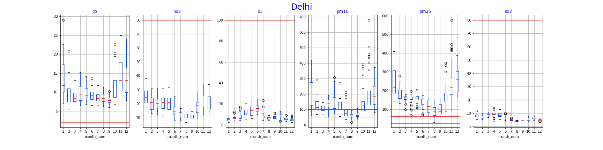
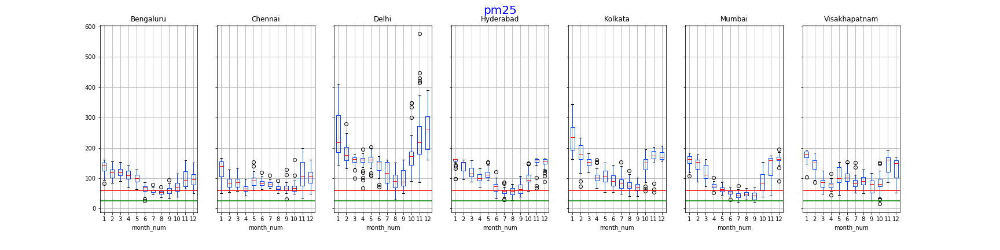
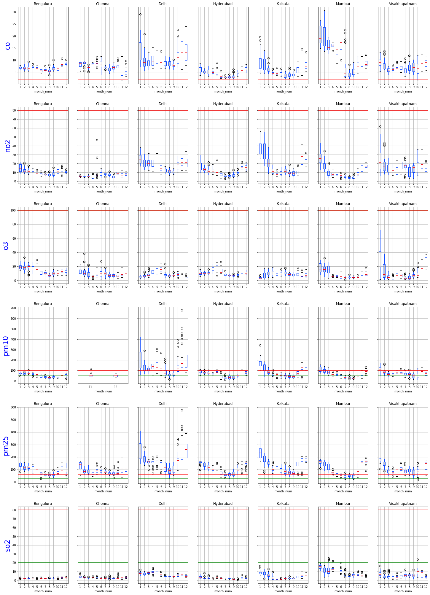
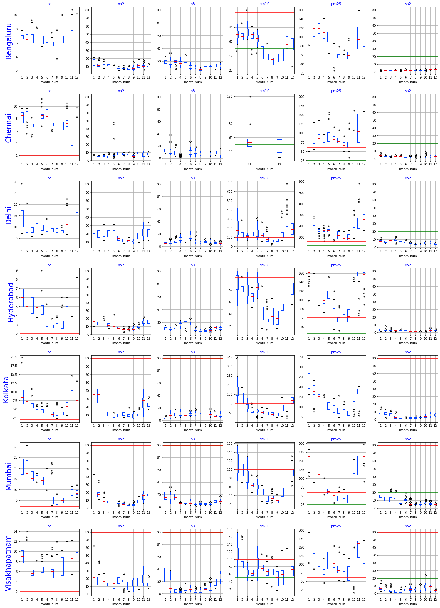

# Pollution in Indian Cities: The 2019 Story

In this post, we do a quick scan to get a sense of the pollution level in a few Indian cities.
Details of pollutants and comparison levels are in [this](./Pollutants%20Description.md) post. 

All data is from [AQI India](https://www.aqi.in), and is locally saved in CSV files and processed. For each city, we have multiple daily 
readings for each pollutant, and we plot the median (usually) or the maximum (for shock effect). 

We're going to use a simple box plot for our initial survey. This is a powerful method of getting a quick overview of what the
data says.

## A First Look: Focus on the City
Take a look at the following picture for Delhi: 
In the above image, we plot the summary statistics of the median values of a pollutant for each month.

The box plot shows five main components of a data series: the minimum, first quartile, median, third quartile and maximum. The first 
and third quartile are enclosed in a box, the minimum and maximum are shown using whiskers. Finally, outliers are values that lie outside
1.5x the inter-quartile range. See the [Wikipedia Article](https://en.wikipedia.org/wiki/Box_plot) for more information

There are a number of very interesting things that jump out at us, let's look at each in turn.
* Holy pollution levels, Batman! For CO, PM10, and PM25, the median values (and usually all except the minimum outliers) are way above the
WHO and Indian Standards, by ridiculously large amounts. In the month of November, the highest median value of PM2.5 was 580 $\mu g/m^3$,
compared to a WHO guideline of 25 $\mu g/m^3$ and NAAQS guideline of 60 $\mu g/m^3$ for a 24-hour period.
For PM10, the corresponding values were 680 $\mu g/m^3$, 50 $\mu g/m^3$ and 100 $\mu g/m^3$. How are we still alive?
* NO, O3 and SO2 are comfortably safe. I'm actually suspicious about the Ozone and Sulpher Dioxide numbers!
* There is an annual fluctuation that we an see through the year (more to come on this!). The winter months seem to have higher
concentrations of pollutants, while summer is relatively better.
* The range of values we observe for CO and NO are fairly concentrated, but there are a large number of outliers for the rest. 

Similar plots for [Bengaluru](../code/images/boxplot-Bengaluru-pollutants-2019.png), [Chennai](../code/images/boxplot-Chennai-pollutants-2019.png), [Hyderabad](../code/images/boxplot-Hyderabad-pollutants-2019.png),
[Kolkata](../code/images/boxplot-Kolkata-pollutants-2019.png), [Mumbai](../code/images/boxplot-Mumbai-pollutants-2019.png), [Visakhapatnam](../code/images/boxplot-Visakhapatnam-pollutants-2019.png) are available.

## The Second Look: Focus on the Pollutant
We can slice and dice this data in multiple ways. Here's looking at how the pollution varies across cities, for example, focussing on PM25:
 
I've chosen to share the y-axis across all the plots, this makes it easier to see how poorly Delhi fares, with respect to other cities.
Don't get fooled by the relatively low values for Bengaluru, this is an artifact of the skew due to the shared y-axis. Across all
cities, we rarely go below the Indian standards, and never below the WHO standards! Here are similar plots for [CO](../code/images/boxplot-co-cities-2019.png),
[NO2](../code/images/boxplot-no2-cities-2019.png), [Ozone](../code/images/boxplot-o3-cities-2019.png), [PM10](../code/images/boxplot-pm10-cities-2019.png) and [SO2](../code/images/boxplot-so2-cities-2019.png).

## View Three: Putting it Together, by City
Finally, if you want to take a look at all of these together, here is the data organized by pollutant:  

A couple of quick observations. When we organize data by pollutant, and see how different cities compare, it makes sense to have the same y-axis. 
Delhi and 
Mumbai are the most polluted cities -- no surprises there -- but oddly enough, Vizag  seems to be more polluted than Bengaluru, Hyderabad,
Kolkata and Chennai! Either the latter cities are doing something right, or there is something odd hapenning in Vizag. I hope its the former, but 
suspect its the latter.

## Numero Quatro: Putting it Together, by City
And here is a look at the data organized by city:  
All the cities we plot have excessive amounts of CO and PM2.5. PM10 is a mixed bag, and the rest are well below the guidelines.

As mentioned before, we use the median of the daily readings to generate the above plots. 
If you want to be really, really frightened, check out what happens when we use the maximum:
[Max Daily Pollutant Concentration in each city](../code/images/boxplot-pollutants-cities-max-2019.png) and
[Max Daily Pollution in each city](../code/images/boxplot-cities-pollutants-max-2019.png).

The notebook used to generate this data is [here](../code/BoxPlot-cities.ipynb)