# Air Pollution in Indian Cities: The 2020 Story

In a [previous](./BoxPlot-cities-2019.md) post, we looked at using box-plots to understand the amount of pollution in a number of cities across India. See [Pollutants Description](Pollutants%20Description.md) for a description of the pollutants and their acceptable limits.

In this article, we look at what is going on in 2020. The data is for the first seven months (uptil July),
and the standalone images can be generated from the [notebook](../code/BoxPlot-cities.ipynb) directly.
For example, here's a plot for Delhi: 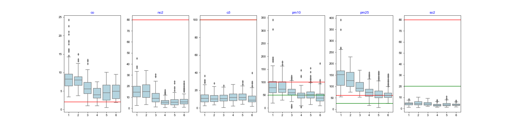

At first glance, this seems similar to the 2019 data that we've seen before - really bad CO, PM2.5 and PM10 levels, 
and pretty good on the others. In addition, there is a peak in the winter and the levels drop as we get into the summer. However, it 
would be much better to compare these with 2019 on the same plot. This will enable us to compare the year to year variation, and 
this year has been unique due to the lockdown.

In order to do the analysis presented in this post, I had to do quite a bit of data wrangling,
see the [notebook](../code/BoxPlot-cities-compareyears.ipynb) for details. I've used the seaborn library to group the month-wise data.

## A Natural Experiment: Impact of Lockdown on Pollution, or, We're not doing the Right things to Reduce Pollution

Here's what a combined picture looks like for Delhi:
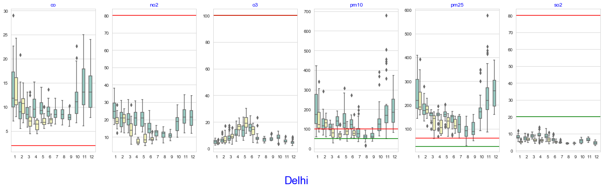
This makes it much easier to compare with 2019, and what we find is that there is, indeed, a significant drop
in the pollutants that we
care about between the two years. Here's looking at just CO, PM10 and PM2.5:
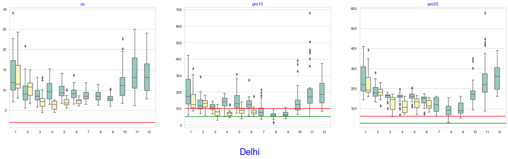
This is interesting. For some reason, January 2020 was less polluted than 2019. February got worse -- I doubt
if this was because it was a leap year! -- and March onwards is much better. There was a nationwide voluntary
curfew on 22nd March, and lockdown went into force on 25th March, so I doubt the improvement in March is due
to this. However, we can confidently say, I think, that the improvements in subsequent months was due to the
lockdown. The exact amount of improvement is the subject of a future post. 

So: to summarize, pollution levels dropped due to the lockdown. The positive aspect is that the PM10 levels easily 
went below the NAAQS 24-hour norms. The depressing part is that the CO and PM2.5 levels were stubbornly well above
this value! A complete cessation of economic activity should, one assumes, stop the generation of pollutants,
and should result in a reduction, however gradual, of existing pollution. It is possible that 
daily activities, possibly burning fuel for cooking, contributes to the generation of pollution. 
It is also possible that my premise is incorrect: existing pollution is not simply going to "go away", especially in
a place like Delhi, where it has no where to go to, and dust from the plains could be blowing particulate matter into the city.

Okay -- would Bombay be better off, then? Its by the sea, so there's enough space for pollution to dissipate, and coastal breezes won't
bring in any additional pollution. Let's take a look!
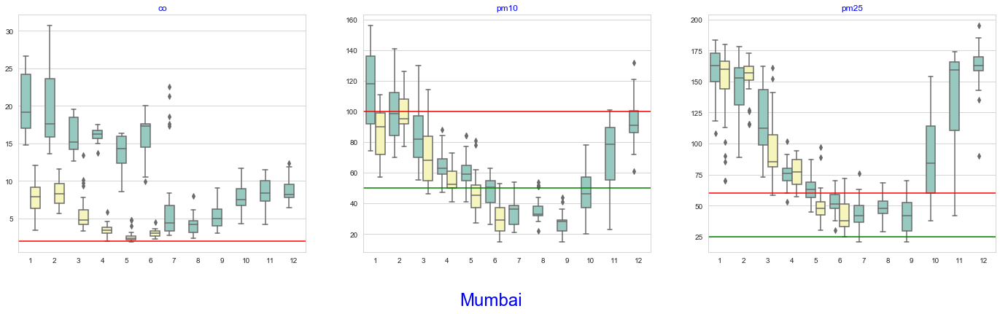
The PM2.5 and PM10 story is similar to Delhi's, except that the pollution level was already lower, so the dip after the
lockdown takes the numbers to breatheable levels. The anamoly is April 2020 for PM2.5, which does not see much impact (the
monthly values are a bit more spread out, but the median is identical to 2019). Carbon Monoxide levels were already lower
in January and February as compared to 2019, and the trend continued in subsequent months. 

This is indeed depressing news. The current approach of reducing pollution is to control the source of pollution. The plots
would suggest that this is not enough, we also need to think about how we need to clean up the pollution that we've already
created. And there don't seem to be any policies to do this!

## Misleading Personal Observations
In our search for silver linings, many headlines pointed out breathlessly (hah!) how residents of Delhi marvelled at the sight 
of blue skies. And how the Himalayas were actually visible. And how the incidence of asthama and other respiratory conditions 
had gone down. See [Bloomberg](https://www.bloomberg.com/news/articles/2020-04-07/world-s-dirtiest-air-gets-cleaner-after-india-s-lockdown) 
on April 8, just two weeks into the lockdown, and [Phys.org](https://phys.org/news/2020-04-locked-down-delhi-revels-fresh-air.html) on
April 22.

Consider this in the context of the drop that we've seen in the charts above. While there has been some reduction, it hasn't been
significant -- we're still over the WHO recommendation! If this little reduction can have such a large anecdotal impact, imagine what
we would experience with an actual drop in pollution levels! The alternative view is that while it felt like things had cleared up,
most of this was psychological, and there hasn't been much improvement. Atleast, that's what the data seems to suggest.

## More Data, Plotted for Your Viewing Pleasure
Data for each city, all pollutants:
[Bengaluru](../code/images/boxplot-Bengaluru-poll-2019-2020.png),
[Chennai](../code/images/boxplot-Chennai-poll-2019-2020.png),
[Delhi](../code/images/boxplot-Delhi-poll-2019-2020.png),
[Hyderabad](../code/images/boxplot-Hyderabad-poll-2019-2020.png),
[Mumbai](../code/images/boxplot-Mumbai-poll-2019-2020.png) and
[Visakhapatnam](../code/images/boxplot-Visakhapatnam-poll-2019-2020.png).
<!--
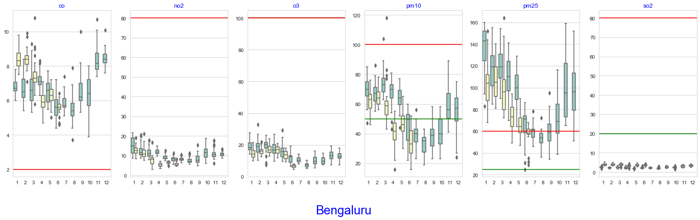
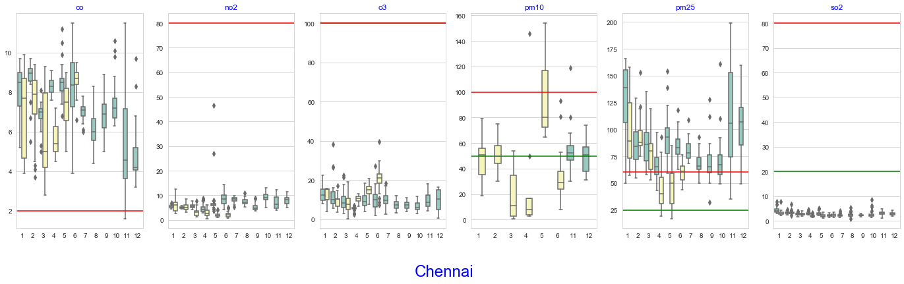

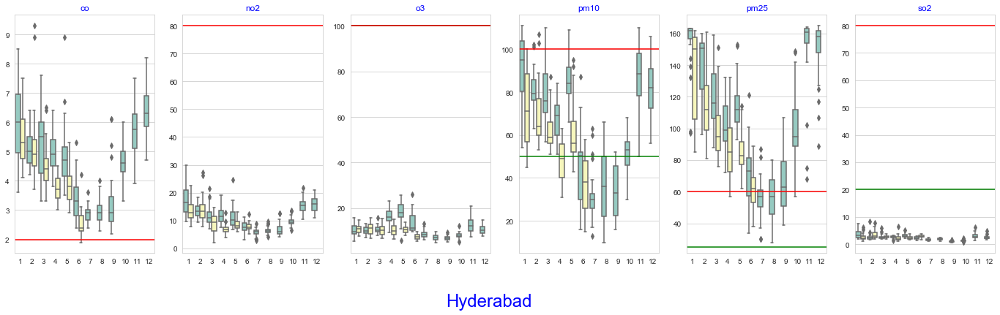
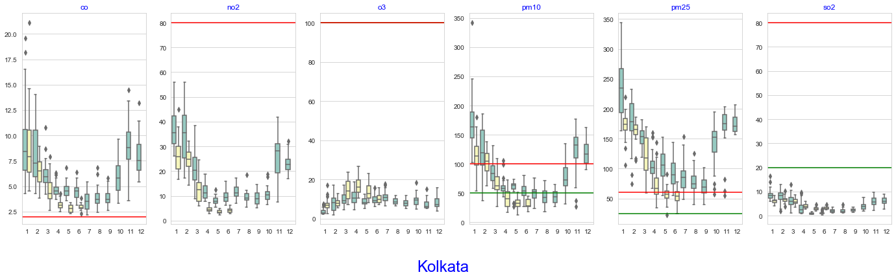
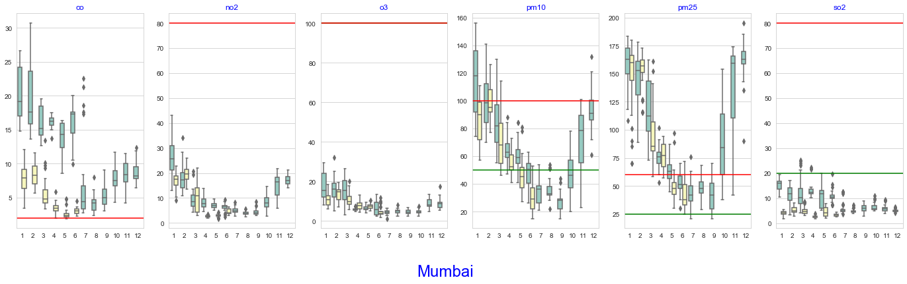

-->

Data for each pollutant, across cities:
[CO](../code/images/boxplot-co-city-2019-2020.png),
[NO2](../code/images/boxplot-no2-city-2019-2020.png),
[O3](../code/images/boxplot-o3-city-2019-2020.png),
[PM10](../code/images/boxplot-pm10-city-2019-2020.png),
[PM2.5](../code/images/boxplot-pm25-city-2019-2020.png) and 
[SO2](../code/images/boxplot-so2-city-2019-2020.png).

<!--
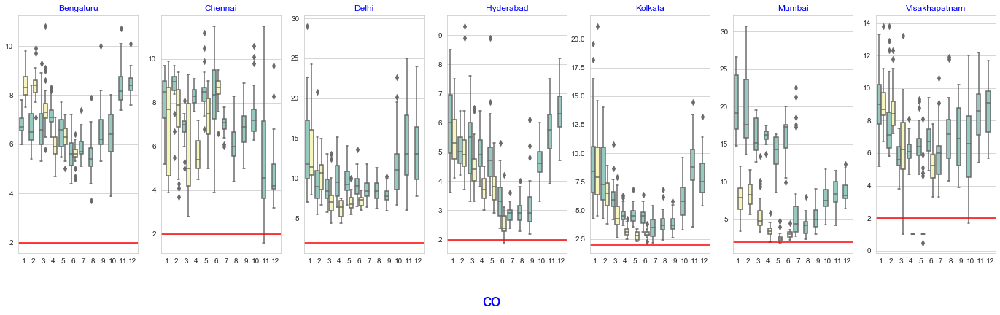
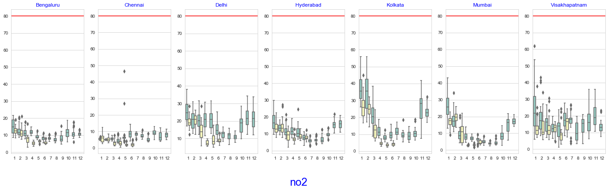
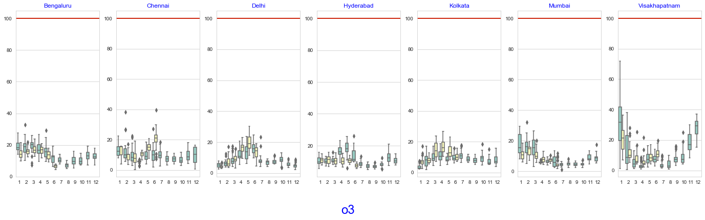
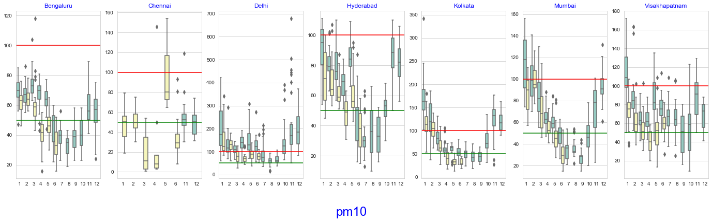
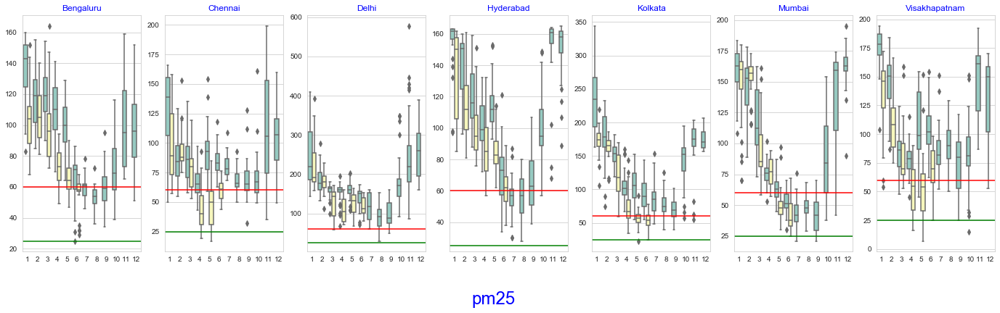

-->

## Conclusion
The lockdown resulted in an unexpected natural experiment. We would have expected that stopping all
economic activity would result in a drop in the production of pollutants. I don't know if this 
has happened or not, but while we see some reduction in the levels, as compared to 2019, the drop is
depressingly small. 

Most policies aimed at reducing pollution focus on the source of pollution. We urgently need to think about
cleaning up the existing pollution as well; this is largely ignored in the current discussion.