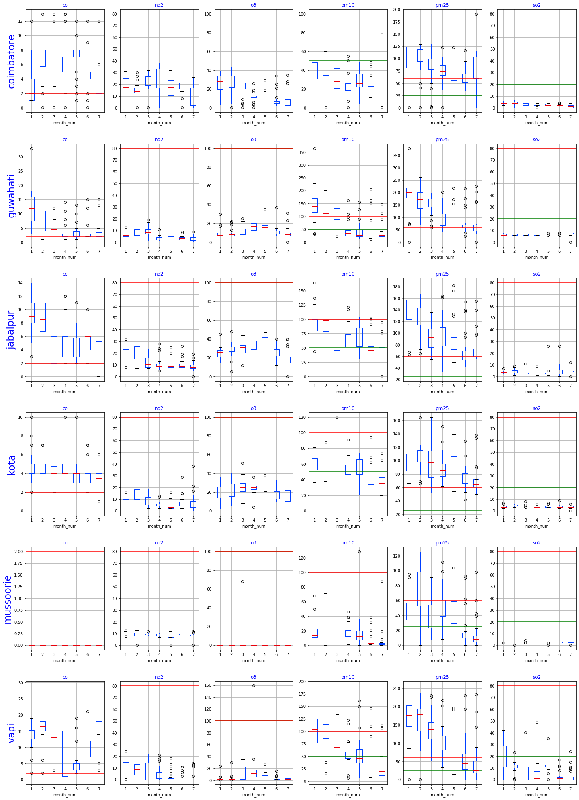
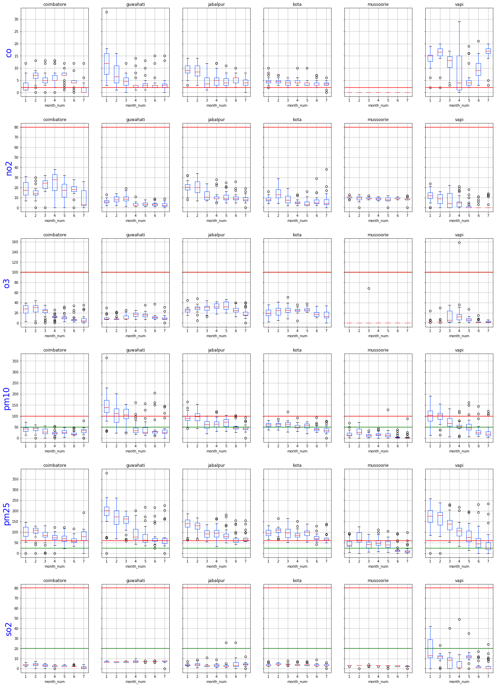
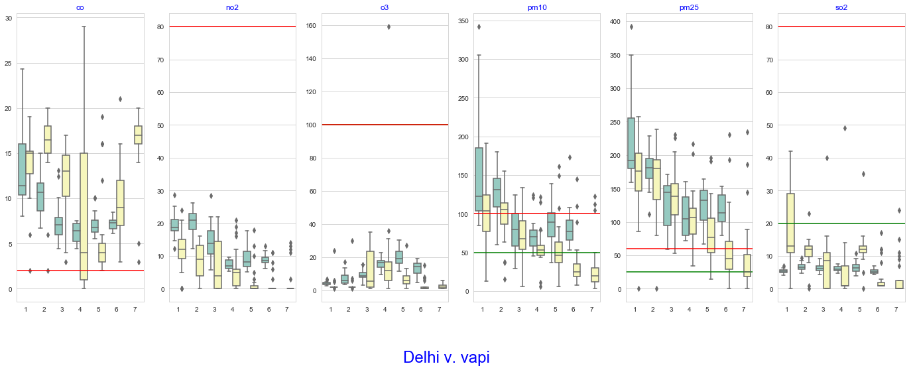

# Pollution in Rural Areas: The 2020 Story

In the last two post using Box Plots, we looked at the pollution levels in a few of the larger cities in
2019 and a comparison in 2020. We next look at pollution in a few rural areas. Note that though we call
them rural areas, the measurement has been done in smaller cities, as far as we can tell. So we don't
really know what the state of the environment in a truly pristine, untouched area really is.

As before, an overview of the components of air pollution are in [this article](Pollutants Description.md). 

There are two dimensions of the comparison presented here. First, in an absolute sense, we can plot
the pollution levels and  compare them against each other. Secondly, we can compare them against the urban
centers and analyze how they stack up. 

## Rural Areas, the Actual Values
For the first, we note that the format of the data is different from that of the urban centers, and
the processing is therefore slightly different. The corresponding notebook is
[here](../code/BoxPlot-rural.ipynb). The plots for each location are:
[Coimbatore](../code/images/boxplot-coimbatore-pollutants-2020.png)
[Guwahati](../code/images/boxplot-guwahati-pollutants-2020.png), 
[Jabalpur](../code/images/boxplot-jabalpur-pollutants-2020.png), 
[Kota](../code/images/boxplot-kota-pollutants-2020.png), 
[Mussoorie](../code/images/boxplot-mussoorie-pollutants-2020.png), and
[Vapi](../code/images/boxplot-vapi-pollutants-2020.png), and all
together: 

We would hope that smaller cities are cleaner than larger ones. Recall that the urban data showed very
good levels of NO2, O3 and SO2, but very poor levels of CO, PM10
and PM2.5. A similar pattern repeats for the  rural areas. The good news is that the CO,
PM10 and PM2.5 levels trend closer to the NAAQS and in some cases,
the WHO levels.  Note that this is only cheering news in comparison; elevated levels of PM2.5
are pretty bad by themselves, even if they are  lower than other regions!

We can, of course, generate plots of each pollutant and how they vary across the selected locations: 
[CO](../code/images/boxplot-co-rural-2020.png),
[NO2](../code/images/boxplot-no2-rural-2020.png), [Ozone](../code/images/boxplot-o3-rural-2020.png),
[PM10](../code/images/boxplot-pm10-rural-2020.png),
[PM2.5](../code/images/boxplot-pm25-rural-2020.png) and [SO2](../code/images/boxplot-so2-rural-2020.png), and all together: 

I do find it odd that Guwahati and Vapi are the more polluted areas, but on reflection this is probably because of 
Guwahati being more urbanized than the others and Vapi having a higher concentration of industrial activity. Another 
unexpected pattern is the variation of the pollutant levels as the lockdown went into effect. In some cases, such as CO in Vapi,
we see an increase(!) and in others, such as PM2.5 there is a slight change in some areas and a large change in others.
We discuss some of this in the next section, and a deeper analysis is in preparation.

## Rural v. Urban: How do they stack up?
The interesting pythonic challenge of doing this comparison was getting the different formats for the rural and urban
data into a single format, so that we can plot the data for comparison. See
[this notebook](../code/BoxPlot-compare-urban-rural.ipynb) for generating the plots below, and
[this notebook](../code/DataFrame Rationalization.ipynb) for converting formats in both directions.

We start with comparing the most polluted urban city (Delhi) and rural region (Vapi). Here's how this looks: 

Let's analyze this picture in two parts. For the first three months, Vapi is just as polluted as Delhi is, and in
some cases, such as CO and SO2, it is much worse! The next part is April onwards, i.e., after the lockdown.
As pointed up above, there is the puzzling increase in CO levels in Vapi. I have no explanation for this.
The PM10 and PM2.5 comparison is very interesting: If you recall the
[discussion](BoxPlot-cities-2020.md) on the effect of the lockdown when comparing 2020 and 2019 for Delhi,
we did not see as much of a drop as expected. We do see this drop in Vapi, especially in April and
May. This points us towards the source of pollution. In Vapi, pollution (especially particulate matter) is due to
industrial activity. The lockdown resulted in a temporary halt in the production of PM, and we see a corresponding
drop. In Delhi, pollution is due to human activities, especially travel and household cooking. These didn't stop 
because of the lockdown, hence the lower impact. 

I do realize that this is just a superficial analysis on my part, based on the data that I have. I'm not an 
expert, and would love to get a better opinion on this!

## Multiple Comparisons
There's a combinatorially large number of comparisons that are possible here, and it is difficult to identify which
would be the more insightful ones. We could also organize the data
according to pollutants-in-cities or pollutants-across-cities, as we have been, but now we have many more 'cities' 
to incorporate. We could group the boxplots by cities, but the problem is which cities to compare.
The Delhi v. Vapi above was based on the most polluted urban and rural regions, but
if we had a different set of cities, the choice would have been different. 

Programmatically, we could generate all possible pairs (or groups of three or four cities) and plot the corresponding
data. However, this would lead to too many charts, and I doubt if we would be able to draw any meaningful comparisons,
other than anecdotal observations. The goal of visualization is to offer insight into data. Generating too many
charts is counterproductive to this goal, so I suspect that we have reached the end of what is possible with boxplots!

## Conclusion
More than the pollution data, I have an observation about boxplots. These are great for summary data of course,
but are even better when we want to compare data from e.g. two cities against each other. 