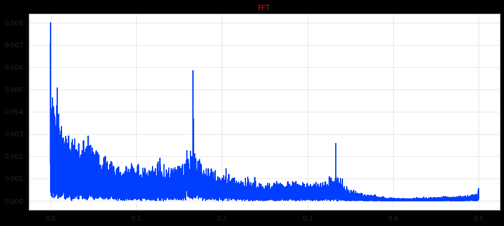
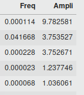
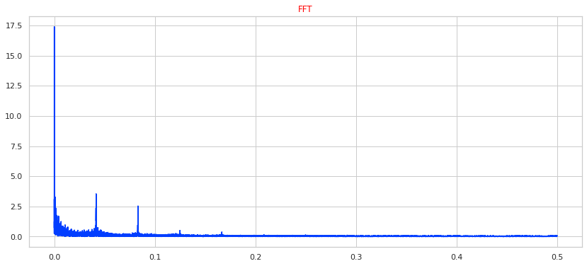
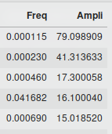
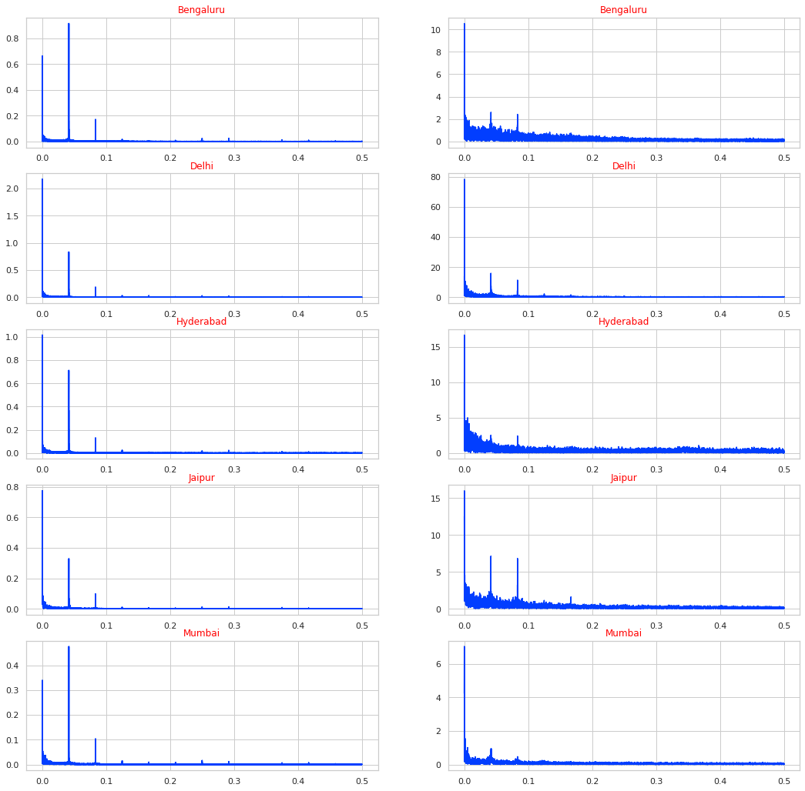

# Exploring Fourier Transforms

In the previous post we tried, to explore the relationship between temperature and pollutant level using various method and ended up with Fourier Transforms as the best way to visualize and quantify the above mentioned relationship.

### Data  

The data we use here has hourly readings for various meteorological factors like temperature, humidity, precipitation and pollutant like PM2.5, PM10, SO2, CO etc. The data is available for five Indian cities namely Mumbai, Delhi, Bengaluru, Hyderabad, Jaipur and the availablity is from 2015 - present.

### Fourier Transforms

To put it simply, Fourier Transforms takes in time-based data/pattern, tries to decomposes it in a bunch of sine waves and returns the frequency and the amplitude of the same. It is similar to extracting ingridients from a dish.

 
fig 1 : FFT (Fast Fourier Transform) of Temperature for Delhi.

Taking the fourier transform we can see, two distinct frequency with significant amplitude. Let us explore which frequencies might these be?

 

Examining further, the frequency which maximum amplitude is 0.00014 i.e 1 / 365 * 24. This corresponds with the yearly variation of temperature which is expected. The second dominant frequency is 0.0416 i.e 1/24, corresponding to the daily variation in our temperature. Thus, temperature seems to follow a yearly and a daily trend evident from the Fourier transform. Now lets explore the same thing for PM 2.5.

 
fig 1 : FFT (Fast Fourier Transform) of PM 2.5  for Delhi.

We again see similar dominant frequencies for PM 2.5  as well. But overall there are a large number of non-dominant frequencies present as well attributed to the greater flucations of PM2.5 readings.

 

The most dominant frequency is the same as the temperature one i.e 0.00015 = 1 / 365 * 24, corresponding the yearly variation. Thus PM 2.5  also follows the yearly pattern. More interestingly the following dominant frequency are half-yearly and quater-yearly. Again, 0.0416 = 1 / 24 shows up, the daily frequency. Thus, there exists a yearly and daily realtionship between Temperature and PM2.5 and this is shown elegantly by FFT.

### Fourier Transform for other cities.

 

### Conclusion
.....

