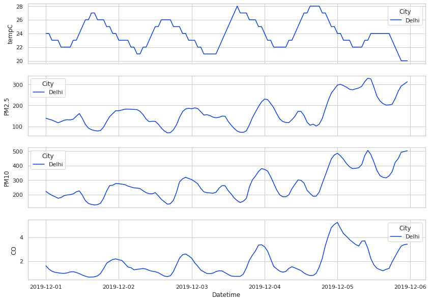
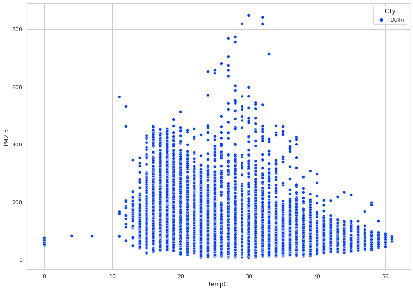
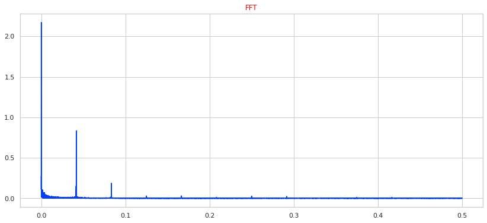
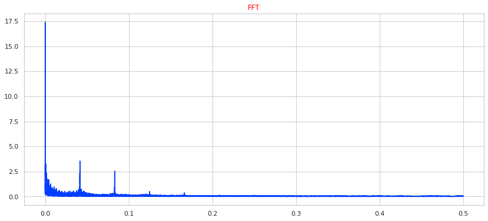

# Does temperature afftect pollutant levels?

Ever wondered the how the pollutant levels change through the day, when does it peak? When is it at its lowest? What is the relationship between temperatue and pollutant levels, if any at all? In this article, we will be exploring and trying to answer the above questions. We will try to visualize this relationship and  . Have a peek at [Pollution Description](https://github.com/algoasylum/ExploringTheUnseen/blob/master/Posts/Pollutants%20Description.md) for a detailed description of pollutants, their acceptable limits and health problems associated with them.

### Data  

The data we use here has hourly readings for various meteorological factors like temperature, humidity, precipitation and pollutant like PM2.5, PM10, SO2, CO etc. The data is available for five Indian cities namely Mumbai, Delhi, Bengaluru, Hyderabad, Jaipur and the availablity is from 2015 - present.

What would be the best way to visualze the relatonship between temperature and pollutant levels? Lets start out with simple lineplots to get a feel of what we are working with.

### Lineplot

 
Fig1 : Lineplot of Temperature and various pollutants.

Here, we have plotted temperature and various pollutant readings for Delhi for the first 5 days of December 2019. We can clearly see that temprature increase throughout the day and falls during night, which is to be expected. The interesting thing here is that we can also see the variations in pollutants at a hourly level. There also exist a rise and fall pattern in pollutants as well but its rather noisy to draw conclusion. Can we think of a better way to visualize  and quantify the relationship between temperature and pollutants.

### Scatterplot

 
Fig 2 : Scatterplot Temperature vs PM 2.5  for Delhi.

On this scatterplot PM2.5 is plotted against temperature for Delhi for the year of 2019. However, this method fails to present any clear conclusions.

Can we think of a better way? We know from the lineplots that some level of repeating patterns exists with our data, how can we leverage this knowledge? Using frequency here make sense and thus we could try Fourier transform.

### Fourier Transform

 
fig 3 : FFT (Fast Fourier Transform) of Temperature for Delhi.

Voila! We applied fast fourier transform on hourly temperature reading for Delhi and able able to isolate some distinct frequencies which likely correspond to the repeating patterns we saw in the lineplots.

 

Again if we take FFT of hourly PM2.5 readings for Delhi we can can see what appear to the same repeating frequencies as temperatures's FFT. Thus we have found some realtionship between temperature and pollutant level by experimenting with a bunch of method. In an upcoming post we will take a deeper dive into the fourier transforms!

