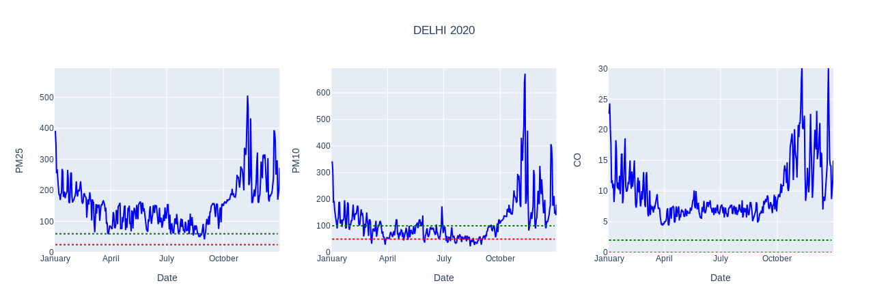
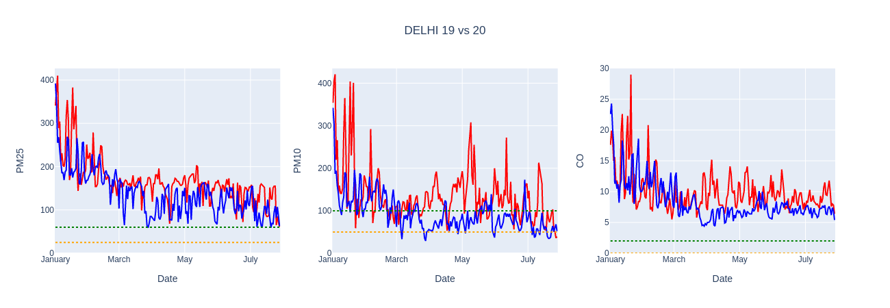
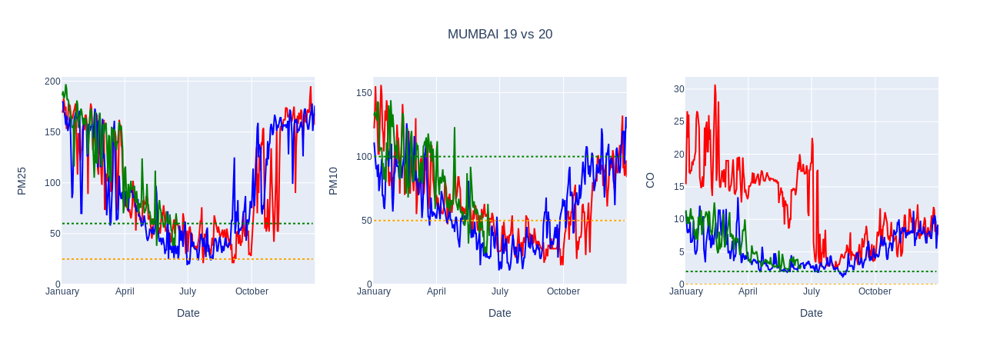
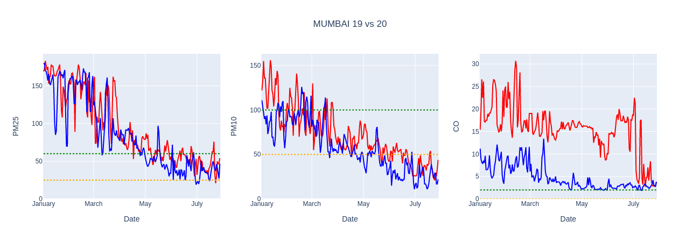
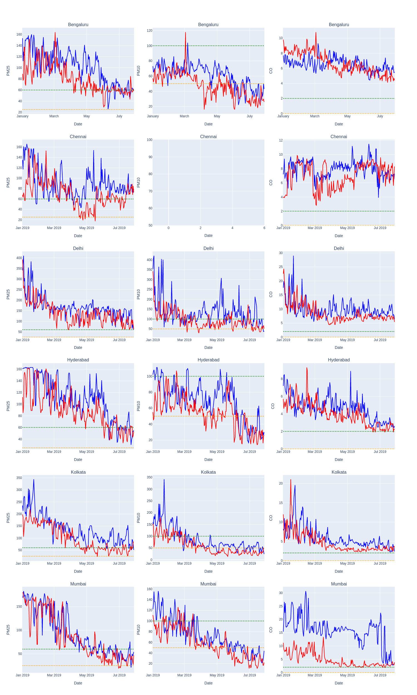
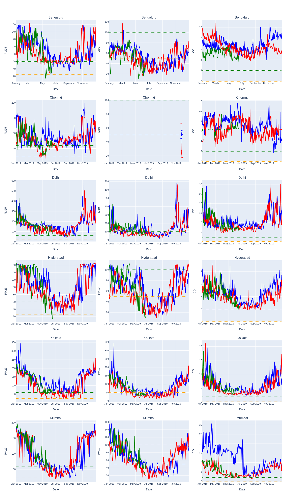

# Pollution in Indian Cities: A comparision 2019 vs 2020

In the previous posts, we looked at a pollution levels in 2019 [here](efef) and 2020 [here](https://github.com/algoasylum/ExploringTheUnseen/blob/master/Posts./LinePlots-urban-2020.md) for major cities in India. In this post tie both of them together and try to assess the impact that Lockdown had on air pollution relative to 2019. Have a peek at [Pollution Description](https://github.com/algoasylum/ExploringTheUnseen/blob/master/Posts/Pollutants%20Description.md) for a detailed description of pollutants, their acceptable limits and health problems associated with them.

### Delhi 2020

 
Fig 1: PM2.5, PM10, CO levels for Delhi 2020

Having a look Delhi's pollution levels, we see there is a reduction across all pollutants, but how can we be sure that this is because of Lockdown and not due to other factors, maybe seasonal trends? To answer this we plot the same pollutants for 2019 as well. By doing this we aim to mitigate the effects of seasonal changes to some extent and isolate the effect of lockdown. In all of the plots Green line represents NAAQS standards and Orange line represents WHO standards.

### '19 vs '20
 
 
Fig 1: PM2.5, PM10, CO levels for Delhi 19 vs 20

In the folowing charts `Red - 2019` and `Blue - 2020` . By super-imposing the 2019 pollution data, `2019 too follows a similar trend` of showing decline in pollution levels as we move from January to July, implying that some of the decline must be due to the seasonal changes and not entirely lockdown, atleast that is what data suggests. PM10 levels for Delhi show the most improvement, PM10 levels even fall under NAAQS standards for 2020. PM2.5 and CO follow the same pattern as '19, just displaced a bit lower.

### Lets look at Mumbai
 
 
Fig 2: PM2.5, PM10, CO levels for Mumbai 19 vs 20

Well, CO levels clearly stand out! We see a significant reduction when compared to '19. But PM2.5 and PM10 values seem to differ/reduce very less, almost follwing each other steps. There is some improvement here, but only marginal. This is an interesting way to look at pollution data, isolating seasonal fluctuation. Lets plot it for all the cities!

### Plot them all!
 
 
Fig 3: 2019 vs 2020 for all cities.

Looks like PM10 data for Chennai is missing. For Banglore, Chennai and Hyderabad,from January to March, the overall trends overlap quite a bit but as we approach April i.e Lockdown phase the two lines begin to diverge and show some level of decline.Look at Banglore PM2.5 for reference, indicating the effect of Lockdown, though the margins are very minuscule. PM2.5 for Delhi and Mumbai for '19 and '20 appears to be very similar show almost no reduction compared to last year even after lockdown.

Only looking a 2020 data indicated massive reduction in pollution levels across the cities but when the seasonal factor was isolated, by comparing the period for last year, `the extent of reduction is quite limited`.

Numerous articles seem to talk about how lockdown has helped with improvement in air pollution, Himalayas becoming visible and so.
With shutting down of industries, transportation and all economic activies at standstill, one would expect huge reduction in air pollution.
Our data seems to suggest only relatively small reduction in pollutant levels were observed compared to last year. We do not know for certain. This begs the question whether this small reduction had such postive impact and if so what a significant drop in overall pollution would look like! or maybe this might be personal misconception and media hyping the overall effects of lockdown.

In an upcoming article we will take into account data from 2015-2020 to have a better understanding of the impact of Lockdown! Stay Tuned! Cheers!

### Github

Code for the visualizations in the post can be found [here](efef)

