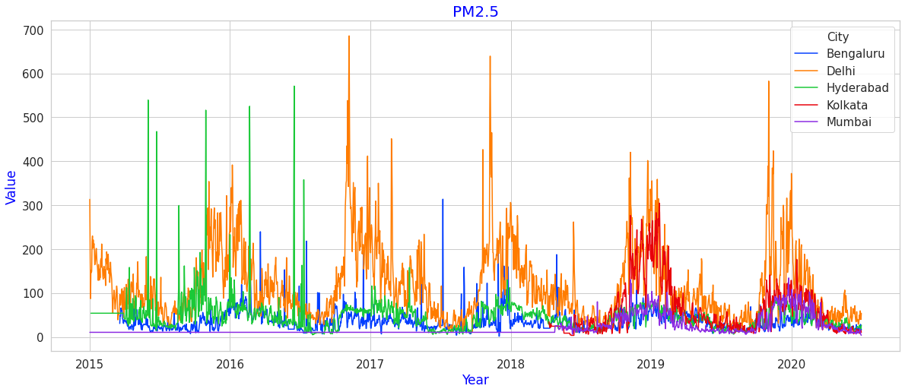
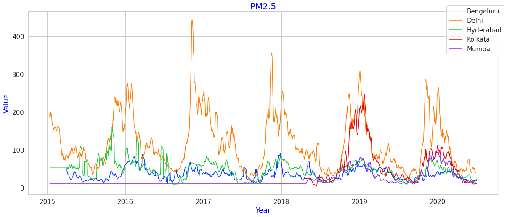
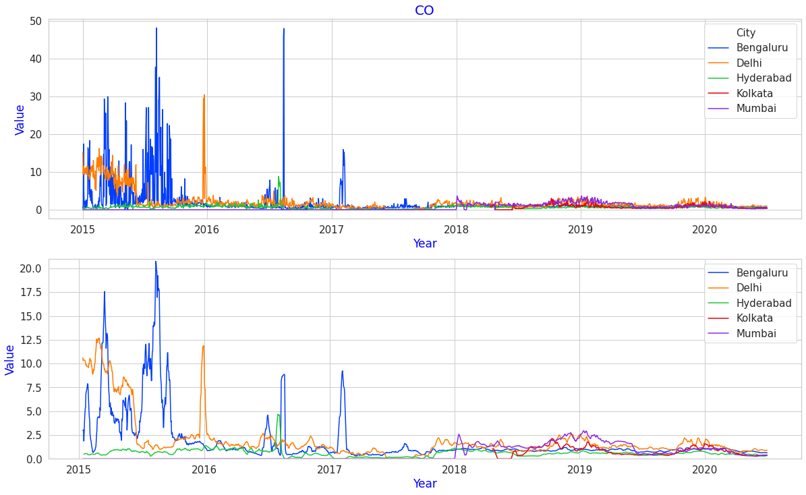
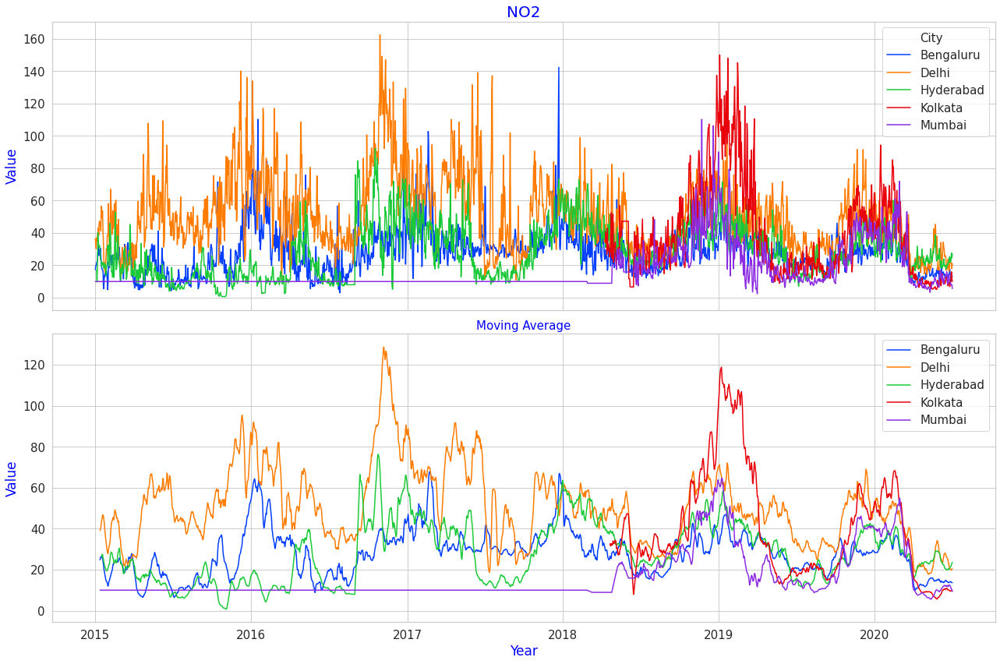
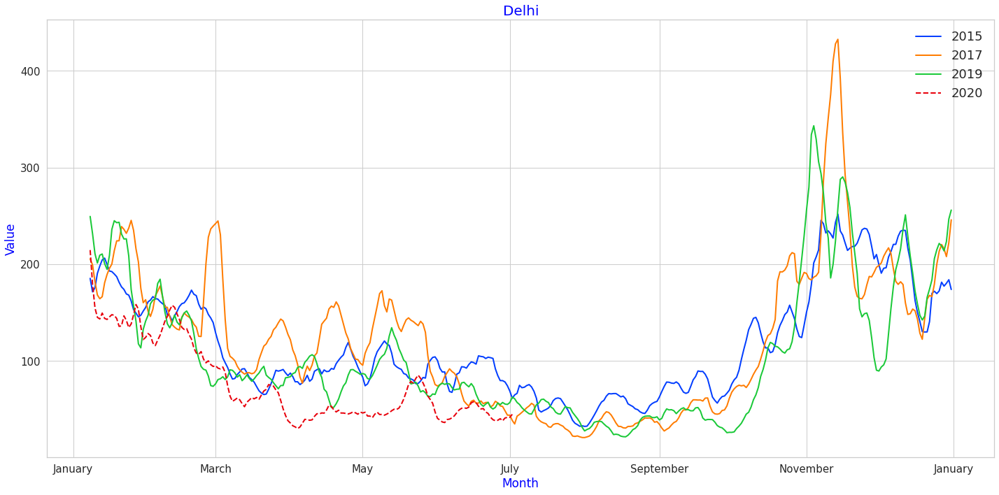

# Pollution in Indian Cities : A more Historic View

In previous [posts](e) we looked at a comparision of pollution levels between 2019 and 2020 for major Indian cities. In this post, we build upon prior post by incorporating more data from previous years : 2015 - 2020 to better understand the pollution trends over a larger period of time. Have a peek at [Pollution Description](https://github.com/algoasylum/ExploringTheUnseen/blob/master/Posts/Pollutants%20Description.md) for a detailed description of pollutants, their acceptable limits and health problems associated with them.

### PM2.5 for all cities

 
Fig 1: PM2.5 levels for all cities

Taking a glance, the data seems too noisy and crowded to derieve any meaningful patterns. To combat this we taking a rolling/moving average of the data with window size as 12. This gives us a better representation of the data for finding patterns, minimizing the impact of noisy data points that might have been caused due to faulty readings.

### The Rolling Average.
 
 
Fig 2: PM2.5 levels for all cities (Moving Average)

Much Better! Delhi is the most polluted of the bunch with 2017 having the highest pollution levels, then the peaks show reduction every year as we move towards 2020. Delhi has the sharpest rise in PM2.5 levels during November, this is most likely due to the crop burning in Punjab and Haryana. Every city follows an annual pattern of peaks and troughs, indicating the impact of seasons on PM2.5 levels. Hyderabas shows reduction after 2016 to some extent. PM2.5 levels for Mumbai and Kolkata are available only after 2019. Kolkata appears to be the second most polluted City.

 
Fig 3: CO levels for all cities (with Moving Average)

Banglore! The CO levels in 2015 for Banglore were through the roof with occasional spikes in 2017. Delhi also has high CO levels in 2015. However as we move on after 2017, the CO levels seemed to have reduced quite a bit for all the cities.

 
Fig 4: NO2 levels for all cities (with Moving Average)

In series like these, the benefit of Moving Average is clearly visible. Delhi again seems to have high NO2 levels, especially in 2017. Here too, we see an annual pattern emerges, though it is not a pronounced as PM2.5. NO2 levels for Mumbai and Kolkata are available only after 2019.
Kolkata seems to have relativly high levels of NO2 even greater than Delhi for 2019. NO2 values for 2020 for almost all cities show some level of reduction.

### Year over Year!

Lets overlay the data for all years in a single chart to see compare changes. Here, we look at PM2.5 values for Delhi.

 
Fig 5: PM2.5 levels for Delhi (with Moving Average)

Representing data in this manner, year over year, make it very easy to compare patterns/similarity over the years. We see a very steep rise as we move from September and gradually decrease towards December. The seasonal trend that PM2.5 follows is very clear from this plot. 2017 had relatively high  levels of PM2.5 and also NO2. The red dotted line represents 2020, and it lowest amongst the bunch. A drop in PM2.5 levels was observed towards the end of March, when lockdown due to Covid-19 was imposed. Yes! we see some level of decline in pollutant levels but the decrease is rather limited and it too fizzles out as we move towards July. 

### Code
Find the code/notebook for the bove plots [here](https://github.com/algoasylum/ExploringTheUnseen/blob/master/code/LinePlots-urban-15-20.ipynb)

