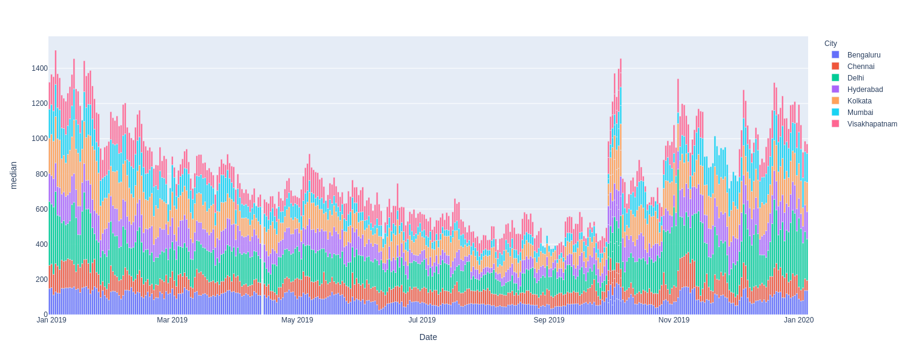
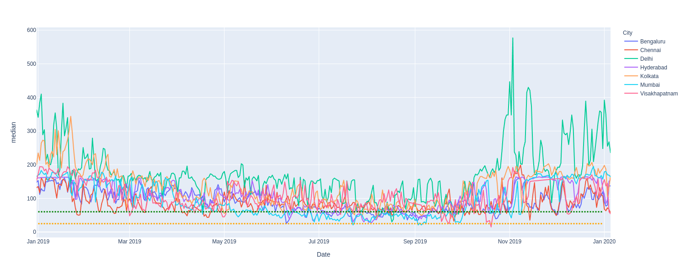
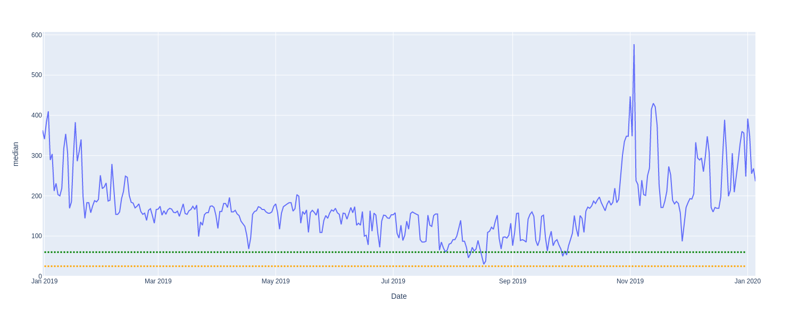
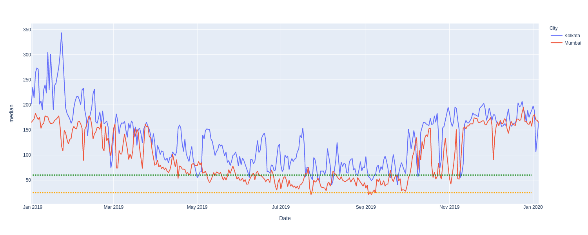
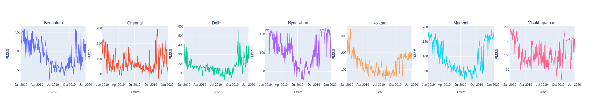
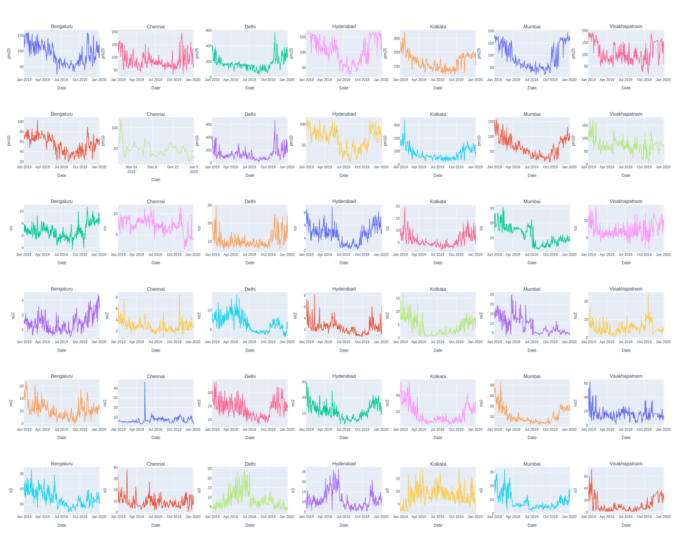

# Pollution in Indian Cities: The 2019 Story

In this post we take a step back from COVID [story](here) and do a quick scan to get a sense of air pollution in few Indian Cities before the lockdown. 

The major components of air pollution are `particulate matter of sizes 2.5 microns and 10 microns` in width (PM2.5 and PM10 respectively), and gases such as `Carbon Monoxide` (CO), `Nitrogen Dioxide` (NO2), `Sulpher Dioxide` (SO2) `Ozone` (O3). In this post we focus a bit more on the PM2.5 levels.

# Generating the Visualization
The AQI values for these cities was obtained from [AQICN](https://aqicn.org/data-platform/) in csv format containing values corresponding to multiple gases for major cities around the globe. Data was loaded into a pandas dataframe in order to extract values corresponding to cities under consideration (in the Indian subcontinent), followed by cleaning and formatting of data in order to incorporate correct date format and resolving discrepancies.
The processed data was passed to the [Plotly graphing library](https://plotly.com/) in order to generate a scatter plot, highlighting the information present.

 
Fig 1 : PM2.5 values for 7 Indian cities represented as a Bar Chart 

In this article we plot line and bar charts of various pollutants for 7 cities, across India. Here dates are plotted on X axis and `Y axis` represents the `median values of pollutants` observed over a 24-hour frame. 

# Observations 
### Lets plot some!

 
Fig 2 : PM2.5 values for Bengaluru, Chennai, Delhi, Hyderabad ,Kolkata ,Mumbai ,Visakhapatnam as line chart. Here the `Green` Line represents `NAACQ` standards and `Yellow` Line represents `WHO` standards.

A bit too much information, right? Lets focus on a fewer cities.

### Focus on Delhi
 
Fig 3: PM2.5 values for Delhi for 2019.

`Delhi` has the overall `highest PM2.5 levels` amongst all the cities considered here. Delhi starts out with higher PM2.5 levels which reduce a bit a remain relatively constant until October where the is a huge surge in PM2.5 levels likely due to the crop burning season creating smog as we approach the end of the year. Also Delhi almost always stays well above he WHO standards and NAACQ standards too.

### A tale of 2 Cities.
 
Fig 4: PM2.5 values for Kolkata and Mumbai

`Kolkata` and `Mumbai` also follow a similar pattern i.e they start out with high PM2.5 levels, drop down towards end of March, a rise after October. Neither fall below the WHO standards but Mumbai complied with the NAACQ standards for a brief period between a May-September.

### PM2.5 for all cities 2019
 

On a higher level, all the cities seem to fit the `U-shaped trend` to some extent. Delhi is the most polluted in PM2.5 levels whereas Hyderabad show the lowest concentrations.

### Plot them all!
 

# Conclusion
`PM10` levels are also similar to PM2.5 trends with the exception of Visakhapatnam which does not have a rise in levels afer October. Delhi and Mumbai have the highest `CO` levels. `SO2` levels are surprisingly low for Delhi where Mumbai and Visakhapatnam top the charts. Visakhapatnam has relatively high `NO2` levels. This provides a concise and visually interesting way to look and pollution trends within our Country’s cities.

### Github

Find the link to our code for these visualizations [here](https://github.com/algoasylum/ExploringTheUnseen/blob/master/code/Simpe%20line%20plots.ipynb) 