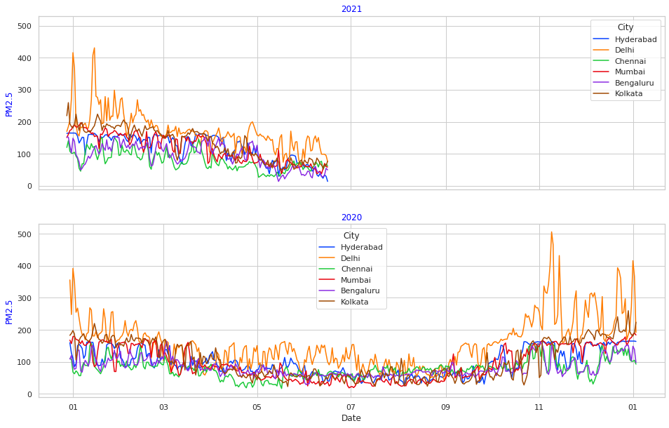
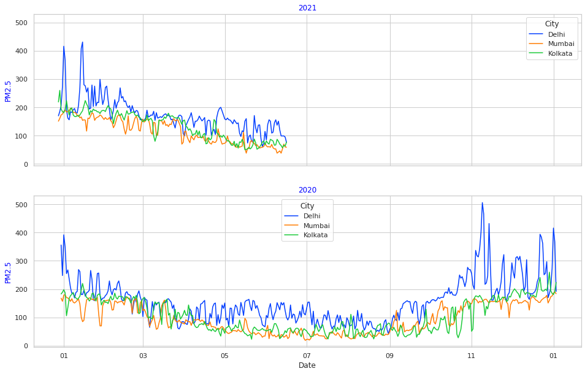
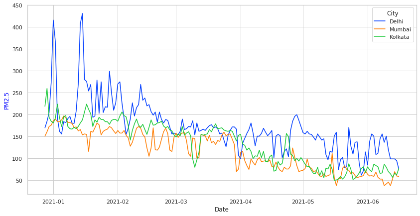
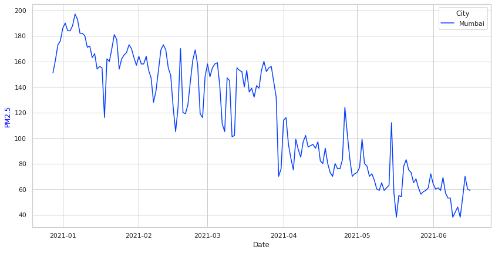
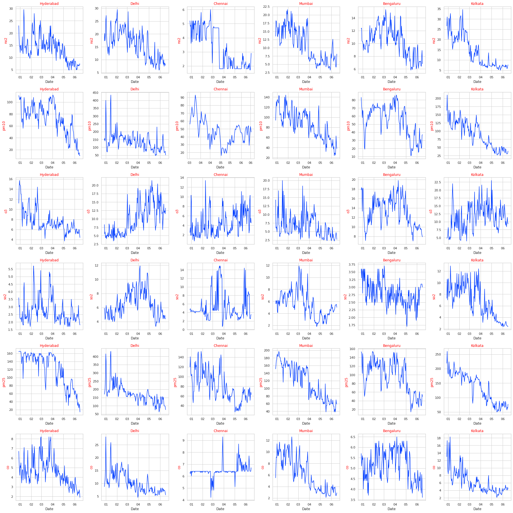

# Pollution in Indian Cities: Lockdown 
In previous posts, we looked at the extent of reduction in pollution due to .The lockdown has led to a pause in most economic activities – manufacturing and construction has ground to a halt and there are no vehicles on the road. There are numerous instances of how this has led to a reduction in environmental pollution, and in this article, we try to make visualize the
scale and rate of what happened.

 

 
 
 
 