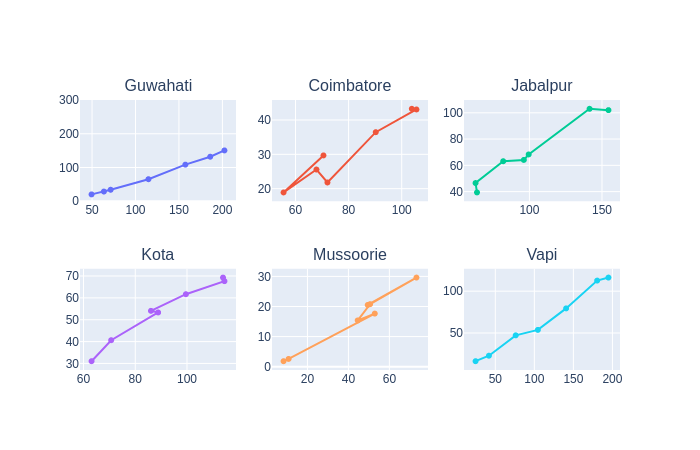

# Particulate Matter in Indian Cities: The Rural Angle

In the previous post, we took a look at the PM (Particulate Matter) levels in major cities like Mumbai, Delhi, Bengaluru, Chennai, Kolkata and Visakhapatnam.In this post, we focus on the PM levels of some of the lesser developed cities namely `Mussoorie`, `Vapi`, `Kota`, `Jabalpur`, `Coimbatore`, `Guwahati` to see their trends in pollution levels as lockdown due to COVID is gradually lifted.

PM (Particulate Matter or particle pollution) is a mixture of solid particles and liquid droplets present in the atmosphere. It comprises of different sizes and can be due to both human and natural sources. While PM 2.5 is mainly produced due to common indoor activities involving tobacco smoke, cooking and burning, PM 10 

Over the past two decades, the concentration of fine particulates increased by 69 percent on average across India. As a result, sustained exposure to particulate pollution now reduces the life expectancy of the typical Indian citizen by 4.3 years compared to 2.2 years in 1998. 

 
Figure: PM 2.5(x) and PM 10(y) levels of multiple cities represented as Scatter Sub-Plots.

In the above figure:
- Each subplot indicates changes in the levels of particulate matter for the mentioned city, over a period of 7 months (Jan 2020 to July 2020).
- Co-ordinates of a point (x,y) represent the PM2.5 and PM10 values for the month respectively. 
- The month-wise temporal trend can be understood by traversing the line in a subplot starting from the rightmost vertex.

# Generating the Visualization
The AQI values for these cities was obtained from [AQICN](https://aqicn.org/data-platform/) in csv format containing values corresponding to multiple gases for major cities around the globe. Data was loaded into a pandas dataframe in order to extract values corresponding to cities under consideration (in the Indian subcontinent), followed by cleaning and formatting of data in order to incorporate correct date format and resolving discrepancies.
The processed data was passed to the [Plotly graphing library](https://plotly.com/) in order to generate a scatter plot, highlighting the information present.

# Observations
Guwahati : While having relatively higher values of particulate matter compared to other cities in the figure, Guwahati observes a steady decline in the PM 2.5 and PM 10 levels as we move from January to July. The decline is accelerated post March, possibly owing to the initiation of the lockdown in March, due to COVID-19.

Coimbatore : While the general decreasing trend of particulate matter levels is prevalent, the PM10 values actually rise from April to May, while the PM 2.5 levels continue to decline. However, the transition from June to July notices a spike in both the values, possibly owing to the relaxation of restrictions placed due to the lockdown.

Jabalpur : The presence of a sharp decline in PM levels from Feb to Mar followed by a relatively small reduction and almost no change in PM10 values over the next couple of months, is quite interesting to observe, given that the lockdown got imposed in Mar itself. This is followed by a subsequent decline in the levels over the next couple of months.

Kota : Apart from a short spike in PM 2.5 levels from April to May, Kota observes a consistent decline in PM levels (Feb onwards).

Mussoorie : Unlike other places covered previously, Mussoorie observes a huge spike in particle pollution levels from Jan to Feb and from April to May, followed by huge declines in levels in the coming months.

Vapi : Fairly linear and consistent reduction in levels of particulate matter from the start of the year to July.

