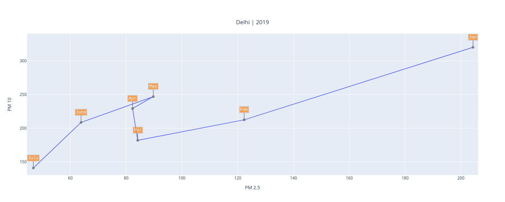
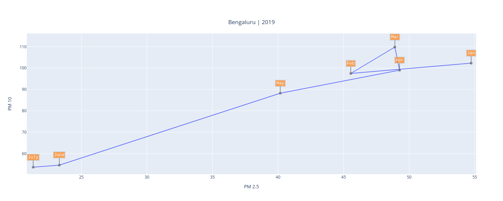
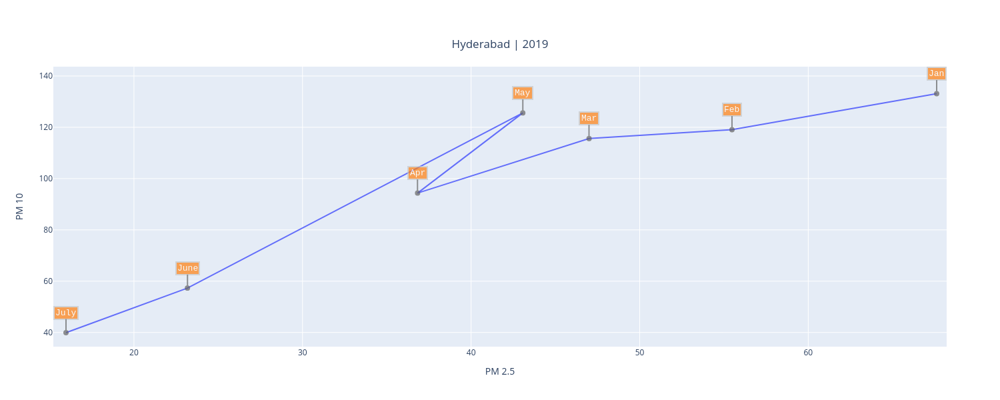
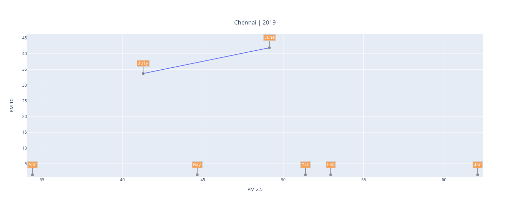
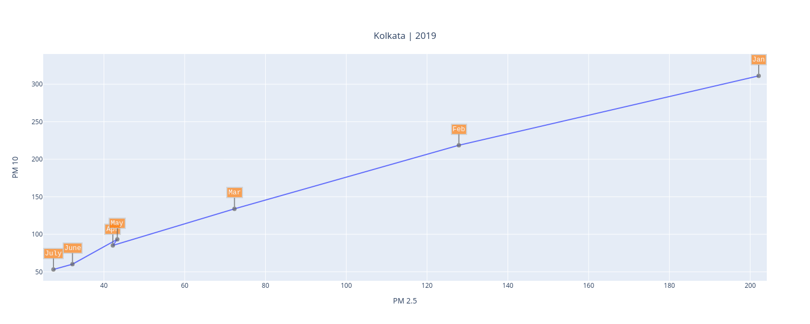
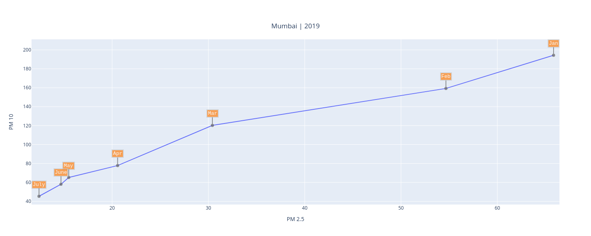

# Particulate Matter in Indian Cities: PM2.5 and PM10

PM (Particulate Matter or particle pollution) is a mixture of solid particles and liquid droplets present in the atmosphere. It comprises of different sizes and can be due to both human and natural sources; primary sources involving automobile emissions,dust and cooking smoke.

Over the past two decades, the concentration of fine particulates increased by 69 percent on average across India. As a result, sustained exposure to particulate pollution now reduces the life expectancy of the typical Indian citizen by 4.3 years compared to 2.2 years in 1998. 
For details about pollutants and their consequences refer this [post](https://github.com/algoasylum/ExploringTheUnseen/blob/master/Posts/Pollutants%20Description.md).

# Generating the Visualization
The AQI values for these cities was obtained from [AQICN](https://aqicn.org/data-platform/) in csv format containing values corresponding to multiple gases for major cities around the globe. Data was loaded into a pandas dataframe in order to extract values corresponding to cities under consideration (in the Indian subcontinent), followed by cleaning and formatting of data in order to incorporate correct date format and resolving discrepancies.
The processed data was passed to the [Plotly graphing library](https://plotly.com/) in order to generate a scatter plot, highlighting the information present.

# Observation

## Delhi: India's Gateway and Capital

 

In the above figure:
- Changes in the levels of particulate matter for Delhi are plotted over a period of 7 months (Jan 2020 to July 2020).
- Co-ordinates of a point (x,y) represent the PM2.5 and PM10 values for the month respectively. 
- The month-wise temporal trend for both the PM values can be understood by traversing the line, starting from the vertex labelled Jan till the last vertex (July).

While having relatively higher values of particulate matter compared to other mentioned cities, Delhi observes a steady decline in the PM2.5 and PM10 levels as we move from January to April. This is followed by a spike from April to May in both particulate levels (possibly owing to certain lockdown relaxations?). However, the declining trend restores and July observes a drastic reduction in PM2.5 and PM10 values, resulting in a significant drop in the particulate levels from the soaring values we started off the year with.

 

From the above 2019 plot for Delhi, it's evident that last year started off with significantly higher PM10 and PM2.5 values (compared to 2020) and maintained the relatively higher values, as we progressed through the year. The spike in PM10 also occurs earlier in 2019 (Mar) as compared to 2020 (Apr). Both the years follow the general trend of decereasing PM levels, interspersed with a spike in between. Hence, our previous intution involving the lockdown relaxation and increased PM levels, doesn't necessarilly seem accurate enough, and requires further investigation!

## Bengaluru: India's Silicon Valley

 

Apart from the initial spike (Jan-Feb), Bangalore observes a declining trend till April. The impact of lockdown is clearly visible as the highest accelerated decline is observed from March-April. Like Delhi, the temporary spike (Apr-May), possibly due to partial restoration of vehicular movement and economic activity is observed, followed by reversion to the decreasing trend. The tech-hub observes a huge improvement in air quality as the year progresses, just like Delhi.

 

When comparing PM levels for Bengaluru for 2019 and 2020, it's evident that while 2020 did observe significant pollution drops, 2019's initial months started off with PM levels way lower than their corresponding 2020 values. It was only around April that the values came within comparable values.

## Hyderabad: The City of Nizams

 

Hyderabad follows the same pattern of declining particulate levels as shown previously, interspersed by the short spike characterized by lockdown relaxations.

 

Hyderabad's PM2.5 levels in Jan 2019 were almost half than that Jan 2020, while PM10 levels for the same month reflected the opposite trend (Jan 2020 PM10 levels being almost half of Jan 2019). The remaining sections of both curves follow a decreasing trend as the years progress, with spiking PM10 values (and PM2.5 as well for 2019) around April.

## Chennai: Gateway to South India

 

 

The AQI data for Chennai procured from <a href="https://cpcb.nic.in/">CPCB</a> was inconsistent/sparse, as it was filled with missing entries ranging over a period of months! The AQI values were missing for the periods: 1st Jan to 18th Jun and 26th Jun to 18th Jul for 2019 and 10th April to 23rd May for 2020. The skewed/misrepresentative curves on the above plots are present due to these inconsistencies in data.

## Kolkata: The City of Joy

 

Kolkata observes a consistent decline in particulate levels throughout, without any intermittent spikes.

 

Even with 2019, Kolkata observed steadily dropping particulate level values, as we progressed through the year. While both years end up with comparable values around June, 2019 experiences significantly higher particulate levels in the initial couple of months, when compared to 2020.

## Mumbai: The Commercial Capital

 

Mumbai experiences a constant decline in PM2.5 and PM10 values, without the presence of any spikes between Apr-June. This is possibly because 95% of the manufacturing sector in Maharashtra halted their production, Mumbai being the worst hit. The government eased the lockdown conditions (only partially) starting May, enabling a small fraction of industries to make a muted start. However, due to the subsequent big dent in consumer demand, most plants are working on low capacity at least until the festive season. From May to July, the levels drop even more sharply, making Mumbai reach an all time low of sub-50 PM2.5 and PM10 levels. 

 

Similar to 2020, Mumbai observes a consistent reduction in PM levels as the year progresses. However, 2019 starts off with way higher PM10 values than 2020 and on the flip side, 2020 starts with more than double PM2.5 levels than 2019. As we proceed to July, the PM levels drop drastically and attain comparable values.

# Conclusion

- At first glance, it's clearly visible that Delhi’s consistently high PM2.5 and PM10 values clearly make it an outlier, when compared to corresponding points from other cities.

- The lockdown due to the COVID19 outbreak got imposed in the month of March. Intuitively, it makes sense to link significant PM level fluctuations (around March) to the imposition and subsequent relaxation of the lockdown (mainly owing to vehicular and industrial emissions which were almost brought to a standstill). However, our comparisons with corresponding plots from 2019 show very similar trends(if not exactly the same), indicating the involvement of other factors responsible for spikes around the same periods.

- The overall, close to linearly decreasing trend for all the plots can be observed as a pattern corresponding to reducing levels of particulate matter, as we progress from the beginning of the year to more recent dates.

 
