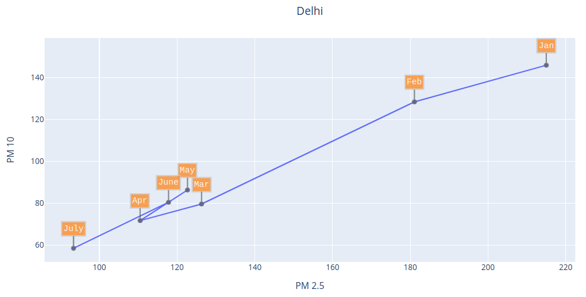
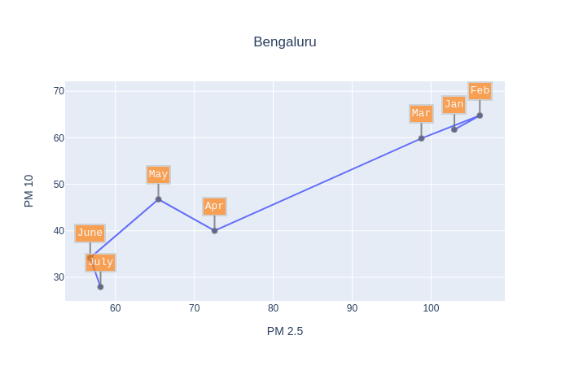
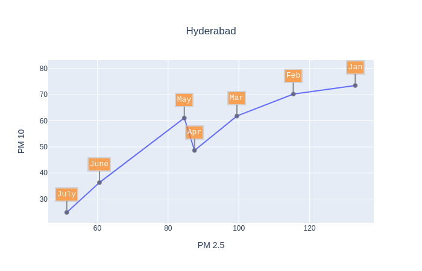
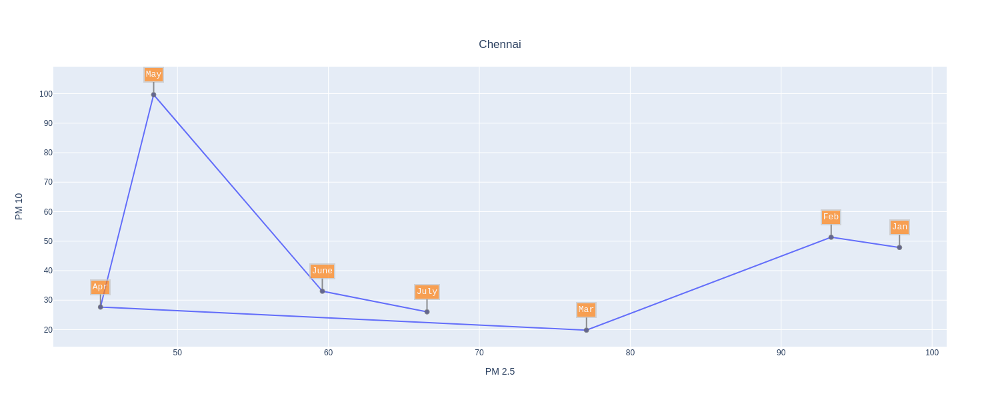
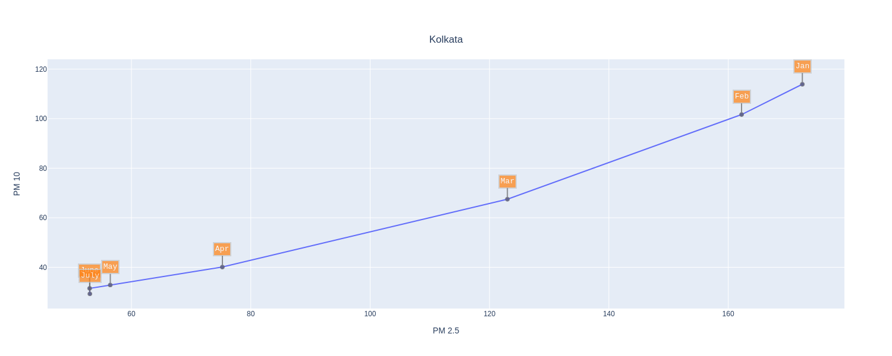
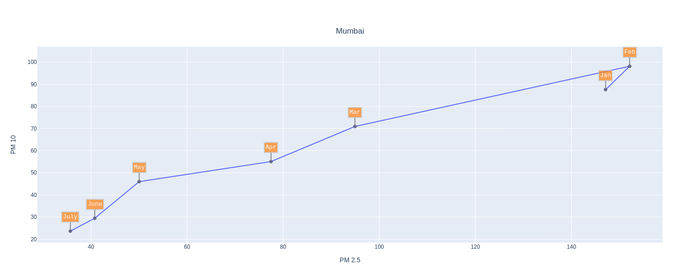

# Particulate Matter in Indian Cities: PM2.5 and PM10

PM (Particulate Matter or particle pollution) is a mixture of solid particles and liquid droplets present in the atmosphere. It comprises of different sizes and can be due to both human and natural sources; primary sources involving automobile emissions,dust and cooking smoke.

Over the past two decades, the concentration of fine particulates increased by 69 percent on average across India. As a result, sustained exposure to particulate pollution now reduces the life expectancy of the typical Indian citizen by 4.3 years compared to 2.2 years in 1998. 
For details about pollutants and their consequences refer this [post](https://github.com/algoasylum/ExploringTheUnseen/blob/master/Posts/Pollutants%20Description.md).

# Generating the Visualization
The AQI values for these cities was obtained from [AQICN](https://aqicn.org/data-platform/) in csv format containing values corresponding to multiple gases for major cities around the globe. Data was loaded into a pandas dataframe in order to extract values corresponding to cities under consideration (in the Indian subcontinent), followed by cleaning and formatting of data in order to incorporate correct date format and resolving discrepancies.
The processed data was passed to the [Plotly graphing library](https://plotly.com/) in order to generate a scatter plot, highlighting the information present.

# Observation

Delhi: India's Gateway and Capital

 

In the above figure:
- Changes in the levels of particulate matter for Delhi are plotted over a period of 7 months (Jan 2020 to July 2020).
- Co-ordinates of a point (x,y) represent the PM2.5 and PM10 values for the month respectively. 
- The month-wise temporal trend for both the PM values can be understood by traversing the line, starting from the vertex labelled Jan till the last vertex (July).

While having relatively higher values of particulate matter compared to other mentioned cities, Delhi observes a steady decline in the PM2.5 and PM10 levels as we move from January to April. This is followed by a spike from April to May in both particulate levels, possibly owing to certain lockdown relaxations. However, the declining trend restores and July observes a drastic reduction in PM2.5 and PM10 values, resulting in a significant drop in the particulate levels from the soaring values we started off the year with.

Bengaluru: India's Silicon Valley

 

Apart from the initial spike (Jan-Feb), Bangalore observes a declining trend till April. The impact of lockdown is clearly visible as the highest accelerated decline is observed from March-April. Like Delhi, the temporary spike (Apr-May), possibly due to partial restoration of vehicular movement and economic activity is observed, followed by reversion to the decreasing trend. The tech-hub observes a huge improvement in air quality, just like Delhi.

Hyderabad: The City of Nizams

 

Hyderabad follows the same pattern of declining particulate levels as shown previously, interspersed by the short spike characterized by lockdown relaxations.

Chennai: Gateway to South India

 

Kolkata: The City of Joy

 

Kolkata observes a consistent decline in particulate levels throughout, without any intermittent spikes.

Mumbai: The Commercial Capital

 

Mumbai experiences a constant decline in PM2.5 and PM10 values, without the presence of any spikes between Apr-June. This is possibly because 95% of the manufacturing sector in Maharashtra halted their production, Mumbai being the worst hit. The government eased the lockdown conditions (only partially) starting May, enabling a small fraction of industries to make a muted start. However, due to the subsequent big dent in consumer demand, most plants are working on low capacity at least until the festive season. From May to July, the levels drop even more sharply, making Mumbai reach an all time low of sub-50 PM2.5 and PM10 levels. 

# Conclusion

At first glance, it's clearly visible that Delhi’s consistently high PM2.5 and PM10 values clearly make it an outlier, when compared to corresponding points from other cities.
The overall, close to linearly decreasing trend for all the plots can be observed as a pattern corresponding to reducing levels of particulate matter, as we progress from the beginning of the year to more recent dates.
The lockdown due to the COVID19 outbreak got imposed in the month of March and by factoring in the relevant changes that took place in the daily functioning of these cities (mainly, vehicular and industrial emissions which were almost brought to a standstill), it could possibly mean that these lockdown attributes account for majority of the reduced pollution levels. 
