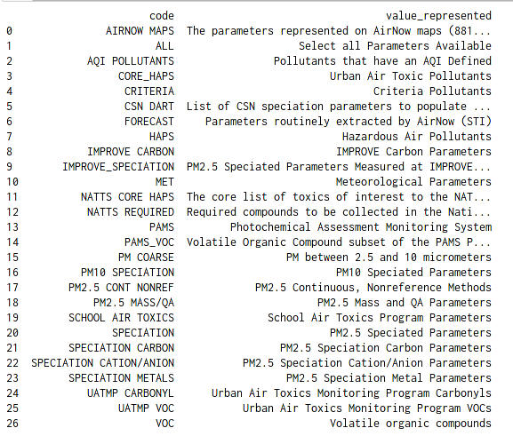
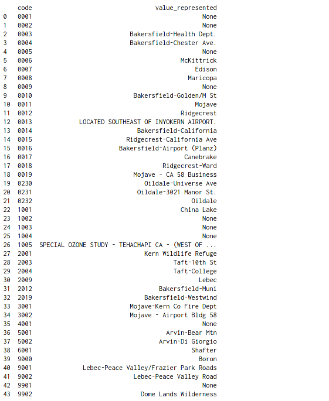

## Particulate Matter in Cities in the United States
### A Guide on using EPA'S Air Quality System API

AQS contains ambient air sample data collected by state, local, tribal, and federal air pollution control agencies from thousands of monitors around the United States. It also contains meteorological data, descriptive information about each monitoring station (including its geographic location and its operator), and information about the quality of the samples.

[Note, AQS does not contain real-time air quality data (it can take 6 months or more from the time data is collected until it is in AQS]

Data from this API is available to anyone. In this article, we'll walk you through process of interacting with the API, fetching data from the EPA database and getting you started with your own experiments!

#### Obtaining API Key
In order to use the API, you're required to [Sign Up] (https://aqs.epa.gov/aqsweb/documents/data_api.html#signup) for the service. This involves registering and validating your email address. To register using the email address "myemail@example.com" create and request this link (paste it in the URL of your browser):
<pre></code>
 https://aqs.epa.gov/data/api/signup?email=myemail@example.com 
</code></pre>
(Replace "myemail@example.com" in the example with your email address.)

After requesting this link, you should get a JSON string in your browser window showing - status: "Success" (along with the request time and url)

Your EPA AQS Data Mart account will be created. Click on the link in the mail that you receive from aqsdatamart@epa.gov to confirm your account. You'll be provided with a key. Your user ID is your email address.

#### Utilizing the REST API

Imports
<pre></code>
import pandas as pd
import matplotlib.pyplot as plt
import requests
</code></pre>

Filling credentials
<pre></code>
email = "myemail@example.com" #replace with your email ID
key   = "abcdefgh" #replace with your key
</code></pre>

#### Constructing Requests and Processing Responses

In the subsequent code, we follow a fairly standard approach:\
* Construct a request
    * We'll be working with lists our endpoint. [https://aqs.epa.gov/aqsweb/documents/data_api.html#lists]
    * We'll also use sampleData (the finest grain data reported to EPA) here for demonstration. Filtering will be on the basis of Site, County or State. [https://aqs.epa.gov/aqsweb/documents/data_api.html#sample]
* Convert the response into a json table
* Extract the data, convert into a pandas dataframe\
After this, what we do depends on what we've requested.

What parameter classes are being tracked?

<pre></code>
response = requests.get(f'https://aqs.epa.gov/data/api/list/classes?email={email}&key={key}')
js = response.json()
params = pd.DataFrame(js['Data'])
print(params)
</code></pre>

 

Paramters in a Class (we consider AQI Pollutants):

<pre></code>
response = requests.get(f'https://aqs.epa.gov/data/api/list/parametersByClass?email={email}&key={key}&pc=MET')
js = response.json()
aqi = pd.DataFrame(js['Data'])
print(aqi)
</code></pre>

 

Get a list of states so that we can use the State ID
<pre></code>
response = requests.get(f'https://aqs.epa.gov/data/api/list/states?email={email}&key={key}')
js = response.json()
states = pd.DataFrame(js['Data'])
print(states)
</code></pre>

 

Get counties for a State (California, in this case):
<pre></code>
response = requests.get(f'https://aqs.epa.gov/data/api/list/countiesByState?email={email}&key={key}&state=06')
js = response.json()
counties = pd.DataFrame(js['Data'])
print(counties)
</code></pre>

 

According to Google, Bakersfield, CA is the most polluted city in the US. It's located in Kern County, so now we have:

State code:06, County code: 029

Let's see what monitoring stations we have for Kern county!

<pre></code>
response = requests.get(f'https://aqs.epa.gov/data/api/list/sitesByCounty?email={email}&key={key}&state=06&county=029')
js = response.json()
sites = pd.DataFrame(js['Data'])
print(sites)
</code></pre>

 

Now lets get some data for one site in 2018

<pre></code>
response = requests.get(f'https://aqs.epa.gov/data/api/sampleData/bySite?email={email}&key={key}&param=42101&bdate=20180101&edate=20181231&state=06&county=029&site=2012')
js = response.json()
data = pd.DataFrame(js['Data'])
print(data)
</code></pre>

 
<pre></code>
print(data.columns)
</code></pre>
 

Plotting Data
<pre></code>
d_sorted = data.sort_values(['date_gmt', 'time_gmt'])
d_sorted.plot(x='date_gmt', y='sample_measurement')
</code></pre>
 

It's not necessary that all codes have correspoding sites. As an example, if we print sites for Penobscot County in Maine (Bangor in Penibscot is one of the least polluted states):
<pre></code>
response = requests.get(f'https://aqs.epa.gov/data/api/list/sitesByCounty?email={email}&key={key}&state=23&county=019')
js = response.json()
sites = pd.DataFrame(js['Data'])
pd.set_option('display.max_rows', None)
print(sites)
</code></pre>
 

Similarly, not all values returned have valid data -- or any data! As an example, let's get some data for one site in 2018
(Specified Params: Pollutant Code, Beginned Date, End Date, State, County and Site):
<pre></code>
response = requests.get(f'https://aqs.epa.gov/data/api/sampleData/bySite?email={email}&key={key}&param=42101&bdate=20180101&edate=20181231&state=23&county=019&site=4005')
js = response.json()
data = pd.DataFrame(js['Data'])
print(data.shape)
</code></pre>
The above query returns shape of the data as (0,0), indicating absence of data for our specific query.

One basic way of figuring out which sites (in this case) have data is by using the following loop:
<pre></code>
for i in sites['code']:
    response = requests.get(f'https://aqs.epa.gov/data/api/sampleData/bySite?email={email}&key={key}&param=42101&bdate=20180101&edate=20181231&state=23&county=019&site={i}')
    js = response.json()
    data = pd.DataFrame(js['Data'])
    print(response, i, data.shape)
</code></pre>
 
Here, the values in the parentheses correspond to the shape of the data.\
Let's try another site! 
South Burlington (Chittenden County in Vermont) (State Code:50, County Code:007):
<pre></code>
for i in sites['code']:
    response = requests.get(f'https://aqs.epa.gov/data/api/sampleData/bySite?email={email}&key={key}&param=42101&bdate=20200101&edate=20201231&state=50&county=007&site={i}')
    js = response.json()
    data = pd.DataFrame(js['Data'])
    print(response, i, data.shape)
</code></pre>
 
Success! Sites 0007 and 0014 have data! Now let's get some data for one site in 2018
<pre></code>
response = requests.get(f'https://aqs.epa.gov/data/api/sampleData/bySite?email={email}&key={key}&param=42101&bdate=20180101&edate=20181231&state=50&county=007&site=0014')
js = response.json()
data_vt = pd.DataFrame(js['Data'])
dvt_sorted = data_vt.sort_values(['date_gmt', 'time_gmt'])
print(data_vt.shape)
</code></pre>

Comparing CO2 differences between the most and least polluted cities in the USA

<pre></code>
d_sorted['date_local'] = pd.to_datetime(d_sorted['date_local']) #Bakersfield
dvt_sorted['date_local'] = pd.to_datetime(dvt_sorted['date_local']) #South Burlington
</code></pre>
<pre></code>
fig, ax = plt.subplots(1, 2, figsize=(16,8), sharey=True)
fig.suptitle('Carbon Monoxide difference between the most and least polluted cities in the USA')
ax[0].plot(d_sorted['date_local'], d_sorted['sample_measurement'])
ax[0].set(title = 'Bakersfield, CA', xlabel = '2018', ylabel = 'CO')

ax[1].plot(dvt_sorted['date_local'], dvt_sorted['sample_measurement'])
ax[1].set(title = 'South Burlington, VT', xlabel = '2018', ylabel = 'CO')
plt.show()
</code></pre>

 
Now that the overall structure is in place, we can do the same thing for the other pollutants or for parameters from any other class!
