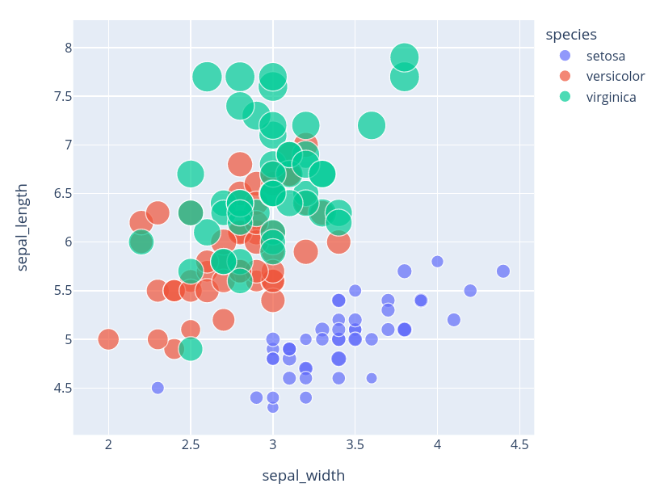

## Embedding Interactive Plotly Visualizations on Websites

Plotly is an open-source, simple-to-use graphing library for python. Plotly.express was built as a wrapper for Plotly.py to make creating interactive visualizations as easy as writing one line of python.

In our previous article, we walked you through our pipeline to generate and analyze Plotly plots on AQI data. Rendering and displaying these interactive visualizations can be done easily by most notebooks and IDEs. Embedding them elsewhere is a different story. If you've been running into trouble with embedding your interactive plotly visualizations, you're in the right place!

### Prerequisites
Python Version: 3.8.3\
Python Packages: Plotly (4.6.0)

### Creating a Visualization
You can refer to our previous post for ideas on generating plots. For now, we'll be creating a basic template visualization:
<code><pre>
df = px.data.iris()
fig = px.scatter(df, x="sepal_width", y="sepal_length", color="species", size='petal_length', hover_data=['petal_width'])
fig.show()
</pre></code>
The following figure should appear in your notebook:
 
Now that our visualization is ready, let's go over hosting and embedding the same!

### Hosting and Embedding Visualizations
When the dataset you’re working with is too big, you will get an error from plotly that you can’t upload the visualization unless you upgrade your account. So to get around this we are going to write our plotly visualization to HTML (and host it on Github Pages instead)

#### Create HTML
To generate the HTML file for the plotly visualization, use:
<pre><code>import plotly.io as pio
pio.write_html(fig, file="viz.html", auto_open=True)
</code></pre>
If done correctly, this will open up the local HTML file in your browser and you should see the visualization.

#### Host to Github Pages
Publishing to Github Pages is quite straightforward. The instructions can be found [here](https://pages.github.com/). As an overview:
- Create a new github repo and initialize with README.mode.
- Upload the viz.html file we just created and commit it to the master branch.
- Now under settings, find the github pages section and ensure that the dropdown under Source has the branch selected as main.
- You should now be able to view your visualization using this link structure : http://username.github.io/repository/viz.html

#### Embed the Visualization with iframe
Now that we have the link to our visualization (hosted on github pages), we can generate an iframe code for the visualization. 

` <iframe id="igraph" scrolling="no" style="border:none;" seamless="seamless" src="<github pages link to visualization>" height="525" width="100%"></iframe> `

After placing this iframe embed code into your site, your visualization will appear! (Note: you might have to modify the height and width).

And there you go -- now you can create an interactive plotly visualization and generate the iframe embed code to display it on any website!
