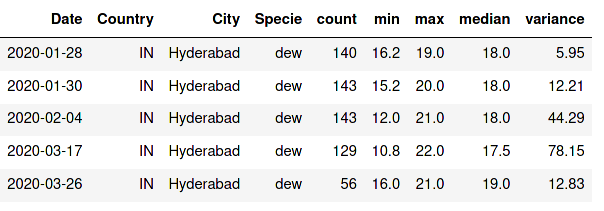
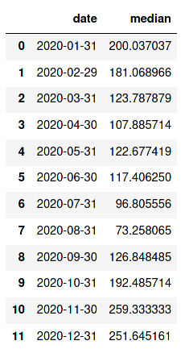

## Particulate Matter in Indian Cities
### A DIY Guide on Engineering and Interactively Plotting AQICN Data

In the previous post, we analyzed AQI data (PM 2.5 and PM10) obtained from
AQICN. The process to obtain these interactive plots involved data processing,
filtering, outlier removal and formation of annotated, interactive plots using
Plotly.

In this post, we'll break-down the procedure (with code) of generating these
plots, so that you can create and analyze your own Plotly scatter plots (on pollution and other data) interactively!

### Prerequisites
Python Version: 3.8.3 (at the time of writing)\
Python Packages: Plotly, Numpy, Pandas #pkg versions

### Setup
- Package Imports:
<code><pre>
import pandas as pd
import numpy as np
import plotly.graph_objects as go
import plotly
import plotly.io as pio
</pre></code>
- Reading CSV as Pandas Dataframe:
<code><pre>
df2020 = pd.read_csv('2020_allyear.csv')
df.head()
</pre></code>

 

### Dataframe Processing:
- Converting Date column to datetime format: 
<code><pre>
df2020.rename(columns = {'Date':'date'}, inplace = True)
df2020['date'] = pd.to_datetime(df2020['date'])
</pre></code>
- Filtering Dataframe based on Year, Particulate Type and City: 
<code><pre>
x = 'Delhi'
df2020_pm25 = df2020[(df2020.date.dt.year==2020) & (df2020['Specie']=='pm25') & (df2020['City']==f'{x}')]
df2020_pm25 = df2020_pm25.sort_values(by = ['City','date'])
</pre></code>
- Applying rolling z-score to column containing PM values ('median') to remove outliers: 
<code><pre>
window = 5
target_column = 'median'
roll = df2020_pm25[target_column].rolling(window)
df2020_pm25 = df2020_pm25[((df2020_pm25[target_column] - roll.mean()) / roll.std()).abs() < 3] 
</pre></code>
- Resampling dataframe to a monthly frequency: 
<code><pre>
df2020_pm25 = df2020_pm25.resample('M', label='right', closed = 'right', on='date').mean().reset_index().sort_values(by='date')
</pre></code>
- Resulting dataframe:
<code><pre>
df.head()
</pre></code>
 

The same procedure can be followed to obtain the required dataframe for other years. 

### Creating Interactive Plots

By using the above approach, say we obtain two dataframes (corresponding to PM 2.5 and PM 10) each for 2020 and 2021. We'll utilise these dataframes to create an interactive scatter plot using the Plotly Graphing Library. This will help us intuitively compare and analyse particulate levels of multiple pollutants for multiple years!

- Creating a figure object and adding traces: 
<code><pre> fig= go.Figure()\
fig.add_trace(go.Scatter(x=df2020_pm25["median"][:6], y=df2020_pm10["median"][:6], mode = 'markers', name="2020"))\
fig.add_trace(go.Scatter(x=df2021_pm25["median"], y=df2021_pm10["median"], mode = 'markers', name="2021"))\
</pre></code>
- Mapping Annotations to Markers (based on coordinates, year and month): 
<code><pre>merged_list_2020 = tuple(zip(df2020_pm25['median'], df2020_pm10['median']))
merged_list_2021 = tuple(zip(df2021_pm25['median'], df2021_pm10['median']))
#labels:
month_20 = ['Jan20','Feb20','Mar20','Apr20','May20','Jun20','Jul20','Aug20','Sep20','Oct20','Nov20','Dec20']
month_21 = ['Jan21','Feb21','Mar21','Apr21','May21','Jun21','Jul21','Aug21','Sep21','Oct21','Nov21','Dec21']
month_list = list(map(lambda x, y:(x,y), month_20, month_21)) \
#include indices of months (to num_month) you wish to annotate (Jan:0, Dec:11)
num_month = [0,1,2,3,4,5] 
</pre></code>
- Annotation Definition and Design
<code>
<pre>
for i in num_month:
    fig.add_annotation(
                x=merged_list_2020[i][0], #2020 PM 2.5 values
                y=merged_list_2020[i][1], #2020 PM 10 values
                text= month_list[i][0],
    showarrow=True,
            font=dict(
                family="Courier New, monospace",
                size=13,
                color="#ffffff"
                ),
            align="center",
            arrowhead=6,
            arrowsize=1,
            arrowwidth=2,
            arrowcolor="#636363",
            ax=0,
            ay=-30,
            bordercolor="#c7c7c7",
            borderwidth=2,
            borderpad=1,
            bgcolor="#ff7f0e",
            opacity=0.7) \

fig.update_annotations(visible=True) 
fig.show()
</pre></code>

### Result

Once done, your interactive plot should something like this:

<iframe id="igraph" scrolling="no" style="border:none;" seamless="seamless" src="https://abhishek-1131.github.io/plotly-plots/Delhi.html" height="525" width="100%"></iframe> 

### Saving your Plot

<code>
pio.write_html(fig, file=f"{x}.html", auto_open=True) 
</code>
 
# where {x} = City Name 
Now that we're ready with our pipeline to generate plots, the next step is embedding these plots into our analyses (while retaining their interactivity!)

