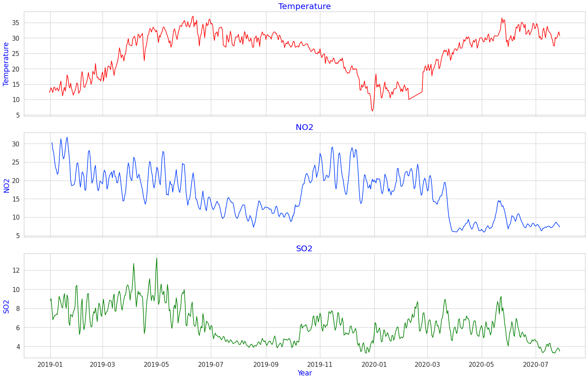
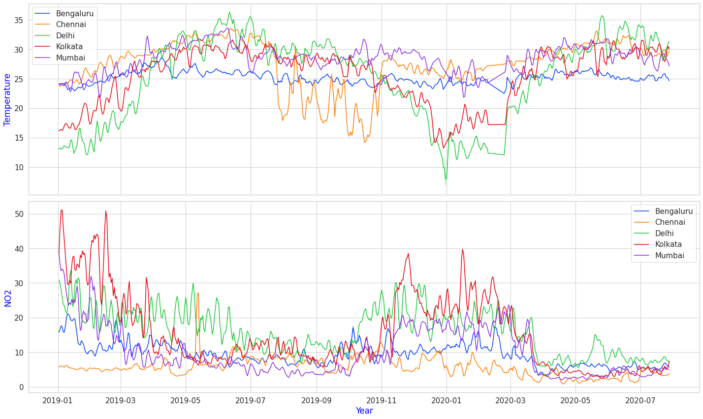
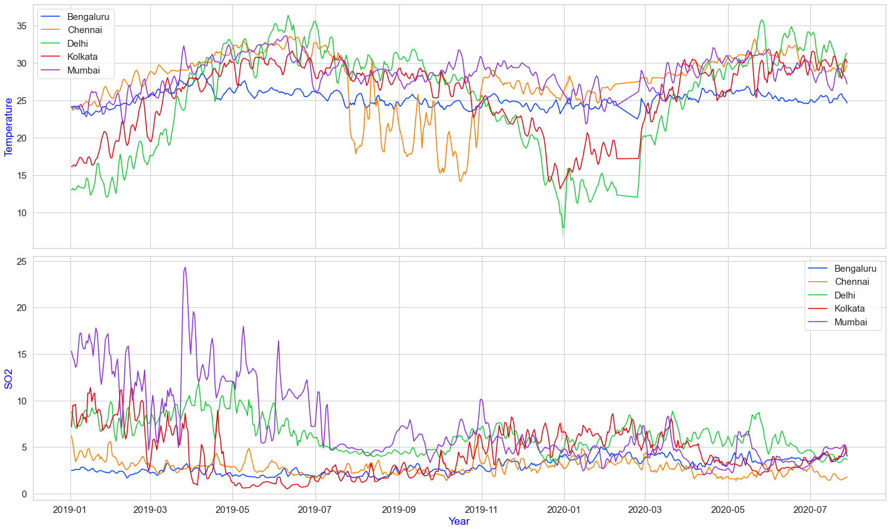
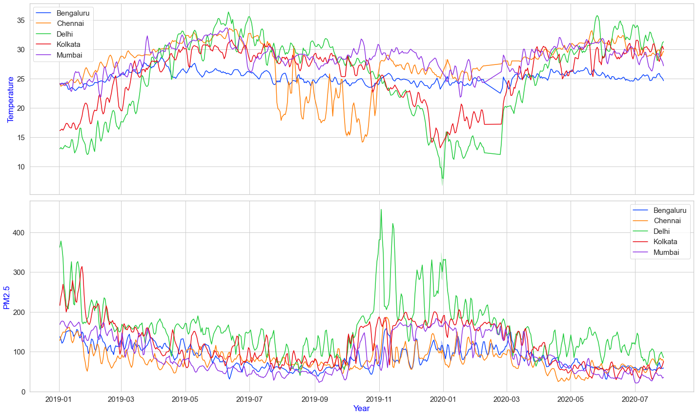
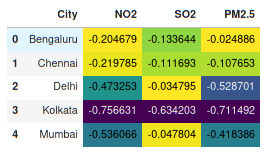

# Pollution in Indian Cities: The Temperature Effect

In previous posts, we looked at pollution trends over many years (2015-2020) and focused on the impact of lockdown due to COVID-19. In this post, we shift our attention to environmental factors like `atmoshperic temperature` and its effects on air pollution. The time period considered here is from 1st January 2019 to 27th July 2020. Have a peek at [Pollution Description](https://github.com/algoasylum/ExploringTheUnseen/blob/master/Posts/Pollutants%20Description.md) for a detailed description of pollutants, their acceptable limits and health problems associated with them.

# Observation
### Lets look at Delhi
 
`Fig1`: Temperature, NO2 and SO2 for Delhi.

Temperature for Delhi starts out low at around 12.5 degrees in January and highest is around 35 degree is summer and again starts decreasing as winter approaches. Eyeballing the NO2 values, we can immediately spot that NO2 values are inversely proprotional and show `negative corelation` with temperature. Quantitatively speaking the corelation coefficient is `-0.473252` (For those who are unaware what correlation coefficient is [here](https://en.wikipedia.org/wiki/Pearson_correlation_coefficient). The reduction in NO2 levels in Delhi after lockdown is visible here. SO2 values seem to follow the temperature curve to some extent, but to much variation to conclude anything.
Another interesting thing to notice is that, we seem reduction in both NO2 and SO2 towards the end of June in 2019 i.e the monsoon period.

### Examining NO2 for all cities
 
`Fig2`: NO2 levels for major Indian cities.

What we observed in Delhi holds True for most Indian cities as well : Negative co-relation between Temperature and NO2 levels. Cities like Bengaluru where temperature is temperature is relatively contast the corelation is weak. Kolkata  shows strong negative corelation with correlation coefficient `-0.7566`.

### For SO2 and PM2.5
 
`Fig3`: SO2 levels for major Indian cities.

Mumbai has high levels of SO2 in the first quater of 2019. The relation with tempearature in not so pronounced here. Another interesting thing is that SO2 levels were more or less constant after November 2019 for most cities.
    
 
`Fig5`: PM2.5 levels for major Indian cities.
    
### The Pearson Correaltion Coefficient
 
`Fig3`: correlation coefficient between Temperature and NO2,SO2 and PM2.5 FOR major Indian cities.

Correlation coefficient ranges from `-1` to `+1`. -1 indicating strong inverse correlation and +1 indicating strong direct correlation. The dataframe is color coded from purple to blue to yellow to green according to the spectrum of light.
To conclude,  `NO2 and PM2.5 show -ve correlation with temperature`, `SO2 has little to no correlation` except Kolkata is an outlier. in future posts we intend to delve into further depth regarding environmental factors and their correlation with air pollutants stay tuned for more!
    
#### Code
    Find the notebooks to create the visualizations [here]().

    

