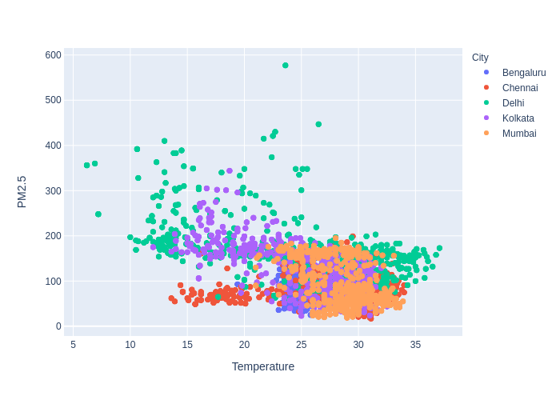
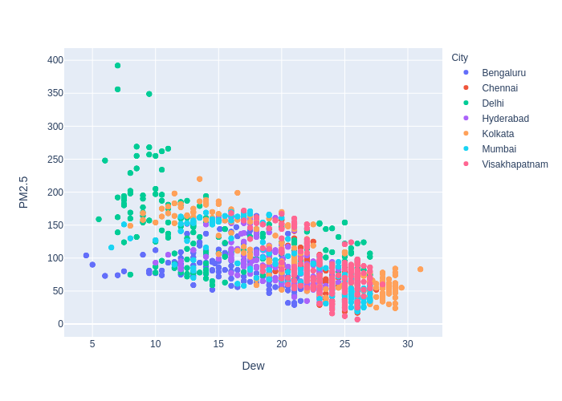
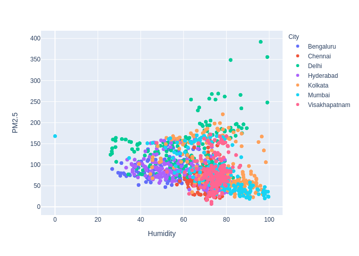

# Pollution in Indian Cities: Focus on Humidity & Temperature

The major components of air pollution are `particulate matter of sizes 2.5 microns and 10 microns` in width (PM2.5 and PM10 respectively), and gases such as `Carbon Monoxide` (CO), `Nitrogen Dioxide` (NO2), `Sulpher Dioxide` (SO2) `Ozone` (O3).

In this article we try to visualize the changes in Environmental factors like `Temperature`, `Dew` and `Humidity` with PM2.5. The time peroid taken into consideration is from 1st January 2020 - 28th July 2020. We try to visualize and understand the trends after the lockdown was imposed.

# Generating the Visualization
The AQI values for these cities was obtained from [AQICN](https://aqicn.org/data-platform/) in csv format containing values corresponding to multiple gases for major cities around the globe. Data was loaded into a pandas dataframe in order to extract values corresponding to cities under consideration (in the Indian subcontinent), followed by cleaning and formatting of data in order to incorporate correct date format and resolving discrepancies.
The processed data was passed to the [Plotly graphing library](https://plotly.com/) in order to generate a scatter plot, highlighting the information present.

# Observation
### Lets plot PM2.5 vs Temperature
 
`Fig1`: PM2.5 vs Temperature for major Indian cities.

We observe that as the Temperature increases the PM2.5 values show some level of reduction. This is quite evident if we focus particularily on Delhi. While a City like Vishakapatnam shows little to no change in its temperature.

### For Dew levels
 
`Fig2`: PM2.5 vs Dew for major Indian cities.

Here we see a similar trend as temperature, as the Dew level increases PM2.5 levels does on decreasing. Again Delhi shows the maximum variaiton in its dew values. Intuitively it makes sense since as temperature reduces more dew is formed.
The relation between PM2.5 and these environmental factors is what we want to understand.

### For Humidity
 
`Fig3`: PM2.5 vs Humidity for major Indian cities.

This one is a mixed bag.

### Plot them all!
 