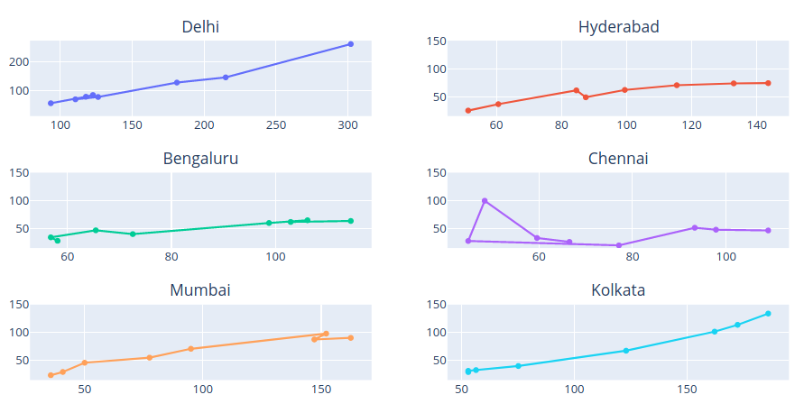

# Particulate Matter in Indian Cities: PM 2.5 and PM 10

 

PM (Particulate Matter or particle pollution) is a mixture of solid particles and liquid droplets present in the atmosphere. It comprises of different sizes and can be due to both human and natural sources; primary sources involving automobile emissions,dust and cooking smoke.

Over the past two decades, the concentration of fine particulates increased by 69 percent on average across India. As a result, sustained exposure to particulate pollution now reduces the life expectancy of the typical Indian citizen by 4.3 years compared to 2.2 years in 1998. 

`The above figure highlights the prevalence of PM 2.5 (x-axis) and PM 10 (y-axis) in multiple cities along with their correlation.`

# Generating the Visualization
The AQI values for these cities was obtained from [AQICN](https://aqicn.org/data-platform/) in csv format containing values corresponding to multiple gases for major cities around the globe. Data was loaded into a pandas dataframe in order to extract values corresponding to cities under consideration (in the Indian subcontinent), followed by cleaning and formatting of data in order to incorporate correct date format and resolving discrepancies.
The processed data was passed to the [Plotly graphing library](https://plotly.com/) in order to generate a scatter plot, highlighting the information present.

# Observation
In the above figure:
- Each subplot indicates changes in the levels of particulate matter for the mentioned city, over a period of 8 months (Dec 2019 to July 2020).
- Co-ordinates of a point (x,y) represent the PM25 and PM10 values for the month respectively. 
- The month-wise temporal trend can be understood by traversing the line in a subplot starting from the rightmost vertex.

At first glance, it's visible that Delhi’s consistently high PM25 and PM10 values clearly make it an outlier, when compared to corresponding points from other cities.
The overall, close to linearly decreasing trend for all the subplots can be observed as a pattern corresponding to reducing levels of particulate matter, as we progress from the beginning of the year to more recent dates.
The lockdown due to the COVID19 outbreak got imposed in the month of March and by factoring in the relevant changes that took place in the daily functioning of these cities (mainly, vehicular and industrial emissions which were almost brought to a standstill), it could possibly mean that these lockdown attributes account for majority of the reduced pollution levels. 
